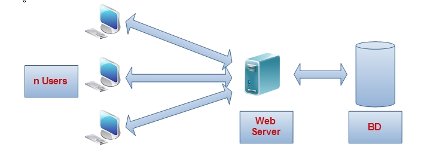
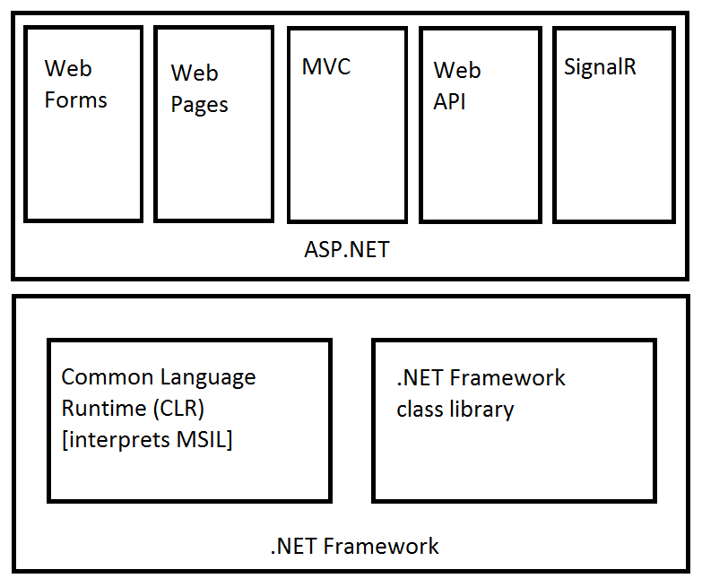

:numbered:
== Web Development

Welcome to {doctitle}. In this text we cover the basics of building full-stack websites in the ASP.NET environment. A full-stack website has three layers: the client browser (Users), the Web Server, and a backing database (BD). The clients share that backing database, but each have their own personal view of it, provided to them by the web server. The users' only way to communicate is through the HTTP protocol, via web pages and asynchronous partial-page AJAX requests.

.https://commons.wikimedia.org/w/index.php?curid=15214941[Website Server Architecture CC-BY Ph.HENCHES]

=== What the user sees

All that the user can see on their side is HTML, rendered by CSS, and supplemented with JavaScript. Every so often, something they do (including the passage of time) triggers a trip back to the web server that can alter the contents on the page or move them to another page. The web server may in turn want to access the backing datastore, typically a database or file system.

[quote,Paul Cookson]
____
Great web design without functionality is like a sports car with no engine.
____

=== What you write

When you develop a website or web application in the ASP.NET environment, you write HTML, JavaScript, and CSS, and then you add server-side coding and databases using Razor to embed C# in your page/application and call out to your own C# classes and those of the ASP.NET library. The database access can be done in several ways; we will be executing SQL classes using the ASP.NET SQLClient. Microsoft also provides LINQ, which provides both a library and _another_ language for database access. The LINQ language is like SQL -- similar to how C# is like Java.

You write your application code in Visual Studio, and when it is run within Visual Studio, it runs in a local web server using IIS Express. IIS is Internet Information Services, Microsoft's web server; IIS Express is a lightweight version for development use. In deployed mode, your application would be packaged and deployed in Internet Information Services (IIS) for Windows® Server or some other web server supporting ASP.NET.

Web applications can be a bit more disorganized than a typical computer program -- web sites turn into spaghetti really easily. So it is best to do some design up front, with a wire-frame diagram, and lay out that design in your development environment -- use directories to separate portions of your code. You will find that the Visual Studio IDE provides some framework for you, separating different types of files into different directories. We'll walk through the Visual Studio organization in the next chapter.

=== Where your code sits

The code you write is meant to live on a file system that is managed by a web server. When a person puts a URL in their browser (or clicks on a search result linking to a URL), that URL is fed to a web server. URLs identify the target machine and then the target page on that machine. The web server takes the target page as input and locates the data to return. It doesn't actually have to go directly to a file, but in our case it will. 

Our users' URLs will map to pages in our web sites. The web server will find the page, and then it will run the C# code on that page and return an HTML page free of Razor and C# to the requesting browser. That means all of your C# code runs on the web server; only JavaScript code runs on the browser. You will need to keep this in mind as you develop your web site: the user's only interaction with your web site is via HTML, that is, links being clicked, forms being submitted, and JavaScript requests being issued. Your only way to communicate back is to provide HTML that is rendered in the user's browser. Keep that in mind, because it is both very limiting and very freeing, like trying to rent an apartment when you have a cat. Some things aren't going to be feasible, or require solutions unlike those you use in traditional stand-alone applications.

=== Microsoft's Alphabet Soup

+.NET+, ASP.NET, CLR, MSIL, MVC -- there are many different names behind the Microsoft technologies. Let's take a look at how they fit together and where we will be working in this text.

[TIP]
====
+.NET+ stands for "dot-net". The N-E-T is not an acronym. It's meant to imply network, internet -- those netty things that drive computers. All of our other letter-words are acronyms.
====

The .NET framework is the underpinning of all *managed code* that runs on a Windows machine. If you write unmanaged code, you are writing raw code that runs against the operating system unchecked. Managed code is run inside the Common Language Runtime (CLR), where there are services for memory management, type safety, thread management, and other features to provide additional security and robustness to your code. The CLR requires that your code be compiled down to Microsoft Intermediate Language (MSIL). It has a just-in-time compiler within it that compiles that code down to machine code.  Microsoft provides compilers (such as those within Visual Studio) that will compile C#, Visual Basic, F#, C++, and other languages to MSIL to be run in the CLR.

The .NET Framework class library provides a large library of classes that can be used by any language compiled to MSIL. This includes basic type services such as string manipulation, file services, database access (often referred to separately as ADO.NET), and collection types. There are also a variety of environments provided in the .NET Framework for developing GUI applications -- we won't be looking into those in this course, as our focus is web applications.

For Web support, ASP.NET provides additional libraries and classes to write richly-functional web sites. Best practices for this, and emerging web technologies, has resulted in 5 different ASP.NET technologies. They share a common core set of classes for HTTP support on the server side, but provide different envirnoments for developing.

* Web Forms provides a very GUI-like experience for users, with widgets on the web page that interact with the server side. This was the first ASP.NET technology and is in wide use. However, it "breaks" several key philosophies in web-site development, and so has been overshadowed by MVC. ASP.NET provides the widgets and the framework for supporting their execution. If you see a URL ending in .aspx, it is using Web Forms.

* Web Pages is a very light-weight framework providing direct hooks between web page content and the server. It uses Razor as a templating language to embed C# in HTML pages. ASP.NET provides a rich set of Helpers and its core functionality to enable rapid development. Web Pages' light-weight ness means it doesn't tend to scale to large web-sites. For that, developers move to MVC. If you see a web page ending in .cshtml, it is using Web Pages.

* MVC is Microsoft's version of the Model-View-Controller design pattern done with C# and Razor. It provides a rich environment for developing web applications in that pattern, as well as rich add-ons such as the Entity Framework for automatic database migration and object-relational mapping. MVC web pages typically are 'just words', with no file extension (on disk, your web pages end in .cshtml, but MVC includes a rich routing engine that maps names to web pages).

* Web API is a way to develop not a web site, but a web service. It relies on the four HTTP verbs (GET, POST, PUT, DELETE) to provide those services. This makes your URL available to service a wider variety of requests, not just web page requests. Microsoft has been folding this technology into MVC, as web sites often want to provide services as well, such as the "APIs" we see that let you put Paypal checkout buttons on boutique websites.

* Signal R provides a web sockets experience, where client and server communicate bidirectionally. It uses web sockets in modern browsers, and provides fall-back support in older browsers. This lets servers push information to clients without a prior client request, useful in situations such as auction sites and near-real-time information sharing.

In this text we will be exploring Web Pages. This is a good entry point for programmers learning C# from another language, giving you time to play with the language in the small before entering the much more rigorous MVC environment.

=== Pobody's nerfect 

Once you start coding you will discover it's hard to write perfect code. You will have to isolate and repair errors in your code to make it work correctly; we call this *debugging*.

.https://en.wikipedia.org/wiki/Software_bug#/media/File:H96566k.jpg[An early computer bug] (Public Domain; work of a federal government employee)

http://thenextweb.com/shareables/2013/09/18/the-very-first-computer-bug/#gref[Bill Burke's journal entry on September 9, 1947] captures an early use of the term bug for a problem in a computer - in this case a real bug, a moth in a relay.

Debugging websites can be more challenging than your typical program, since the error can occur at several levels: database, server-side code, and client-side code. Each has their own software environment and code you've written for them.

The cause of an error can be syntax errors, runtime errors, or semantic errors.

Compilers typically catch syntax errors, when you mistype a keyword or variable name. Runtime errors occur when you run out of memory or access memory incorrectly. Semantic errors are the trickiest to catch and may not be apparent, as they occur when your program simply doesn't do the right thing. For example, your program runs without errors, but does not implement the requested behavior.

Just like written English, where Word cannot catch a "word" error that is not a spelling error, you may use the wrong variable name - when it doesn't match up to any variable, the compiler catches it; but when it matches the wrong variable, the compiler cannot help you.

It can be frustrating to work through any of these. You may not see the syntax error, and the message provided by the compiler may misdirect you. Runtime errors can be hard to isolate, and may be caused by a different part of your code executed long before the error occurred. Semantic errors can be a simple oversight, forgetting a requirement. These can have the most serious repercussions, so it is always a good idea to double-check requirements once your code is complete.

One of the most important skills to develop as a programmer is debugging; the ability to track down the source of an issue and resolve it appropriately. It can be frustrating, but it is always necessary. A typical developer's first job is to take on existing code and "maintain" it. Don't fool yourself -- maintain is another word for "debug". Very few programs are out there that are completely bug-free. Even long-time code has issues. See, for example, the http://heartbleed.com/[Heartbleed bug in OpenSSL].

When you have a bug, you need to be a detective. The behavior you see is a clue. You need to unwind the clues to discover the root cause and fix it there.

=== Debugging

_based on material from [underline]#Think Python# and [underline]#Think Java#_

I realize you do not yet know C#, Razor, and ASP.NET; however, the advice here works for any environment; so compare these ideas to the development work you have already done and see how they are applicable there. Review this section as you learn more about ASP.NET to fit it into what you  learn about C# and Razor along the way.

Different kinds of errors can occur in a program, and it is useful to distinguish among them in order to track them down more quickly:

* Syntax errors are produced by HTML, CSS, JavaScript, Razor, and C# when Visual Studio first encounters them. If you are running "on the wire", without Visual Studio, then they are detected at the first piece of software to handle them. HTML, CSS, and JavaScript syntax errors may not be detected until the browser sees them; most browsers try to recover gracefully, but may also output error messages or bad pages when handed syntactically incorrect HTML, CSS, or JavaScript. Razor and C# syntax errors are detected at compile time (C#) or interpretation time (Razor). It is the web server that interprets Razor and turns it into HTML for the client to display.  Syntax errors indicate that there is something wrong with the syntax of the program. Example: Omitting the semicolon at the end of a C# statement yields an error `unexpected keyword` when the next keyword is found at the start of the next statement.

* Runtime errors are produced by the interpreter if something goes wrong while the program is running. Most runtime error messages include information about where the error occurred and what methods or functions were executing. Example: An infinite recursion eventually cases the runtime error `StackOverflowException`.

* Semantic errors are problems with an application that runs without producing error messages but doesn't do the right thing. Example: An expression may not be evaluated in the order you expect, yielding an incorrect result.

The first step in debugging is to figure out which kind of error you are dealing with. Although the following sections are organized by error type, some techniques are applicable in more than one situation.

==== Syntax errors

Syntax errors are usually easy to fix once you figure out what they
are. Unfortunately, the error messages are often not helpful.
The most common messages are `SyntaxError: invalid syntax` and
`SyntaxError: invalid token`, neither of which is very informative.

On the other hand, the message does tell you where in the program the
problem occurred. Actually, it tells you where Visual Studio
noticed a problem, which is not necessarily where the error
is. Sometimes the error is prior to the location of the error
message, often on the preceding line.

If you are building the program incrementally, you should have
a good idea about where the error is. It will be in the last
line you added.

If you are copying code from a book, start by comparing
your code to the book’s code very carefully. Check every character.
At the same time, remember that the book might be wrong, so
if you see something that looks like a syntax error, it might be.

Nevertheless, you might find yourself in one of the following situations.
For each situation, we have some suggestions about how to proceed.

===== The compiler is spewing error messages.

If the compiler reports 100 error messages, that doesn’t mean there are 100 errors in your program.
When the compiler encounters an error, it often gets thrown off-track for a while.
It tries to recover and pick up again after the first error, but sometimes it reports spurious errors.

Only the first error message is truly reliable.
We suggest that you only fix one error at a time, and then recompile the program.
You may find that one semicolon or brace “fixes” 100 errors.

===== I’m getting a weird compiler message, and it won’t go away.

First of all, read the error message carefully.
It may be written in terse jargon, but often there is a carefully hidden kernel of information.

If nothing else, the message will tell you where in the program the 
problem occurred.
Actually, it tells you where the compiler was when it noticed a problem,
 which is not necessarily where the error is.
Use the information the compiler gives you as a guideline, but if you 
don’t see an error where the compiler is pointing, broaden the search.

Generally the error will be prior to the location of the error message, but there
are cases where it will be somewhere else entirely.
For example, if you get an error message at a method invocation, the 
actual error may be in the method definition itself.

If you don’t find the error quickly, take a breath and look more broadly at the entire program.
Make sure each file is indented properly; that makes it easier to spot syntax errors.

Here are some ways to avoid the most common syntax errors:

.  Make sure you are not using a HTML, CSS, JavaScript, Razor, or C#, keyword for a variable name.

.  Check that all parentheses and brackets are balanced and properly nested.
   All method definitions should be nested within a class definition.
   All program statements should be within a method definition or a Razor code block.
   
.  Remember that uppercase letters are not the same as lowercase letters.
.  Check for semicolons at the end of statements, but no semicolons after a compound statement's curly braces.
.  Make sure that any strings in the code have matching quotation marks.
Make sure that you use double quotes for strings and single quotes for characters in C# and JavaScript code. Make sure that all quotation marks are
"straight quotes", not “curly quotes”. Be careful if you paste in text from
another source.

.  If you have multiline strings, make
sure you have terminated the string properly. An unterminated string
may cause an invalid token error at the end of your program,
or it may treat the following part of the program as a string until it
comes to the next string. In the second case, it might not produce an error
message at all!
. Make sure that the types in your comparison, assignment, or method invocation statement are all compatible and convert correctly: pay attention to the type conversions that automatically occur.
.  For each assignment statement, make sure that the expression on the left is a variable name or something else that you can assign a value to (like an element of an array).

.  An unclosed opening operator--``(``, ``{``, ``<``, or
``[``-- makes most languages continue with the next line as part of the
current statement. Generally, an error occurs almost immediately in
the next line.

.  Check for the classic = instead of == inside a comparison.

. Check for object identity versus value comparison (== vs. === in JavaScript).

.  Check the indentation to make sure it lines up the way it
is supposed to. The best way to avoid this problem
is to use automatic code formatting that generates
consistent indentation.

.  If you have non-ASCII characters in the code (including strings
and comments), that might cause a problem, although most languages usually
handle non-ASCII characters. Be careful if you paste in text from
a web page or other source.

If nothing works, move on to the next section...

===== I can’t get my application to compile no matter what I do.

If Visual Studio says there is an error and you don’t see it, that 
might be because you and the IDE are not looking at the same code.
Check your development environment to make sure the application you are 
editing is the application the IDE is compiling.

This situation is often the result of having multiple copies of the same file.
You might be editing one version of the file, but compiling a different version.

If
 you are not sure, try putting an obvious and deliberate syntax error 
right at the beginning of the program.
Now compile again.
If the compiler doesn’t find the new error, you are not compiling the code you are editting.

There are a few likely culprits:

*   You edited the file and forgot to save the changes before
running it again. Some programming environments do this
for you, but some don’t.
*   You changed the name of the file, but you are still running
the old name.
*   Something in your development environment is configured
incorrectly.

If you get stuck and you can’t figure out what is going on, one
approach is to start again with a new program like “Hello, World!”,
and make sure you can get a known program to run. Then gradually add
the pieces of the original program to the new one. If you don't want to restart, then try this instead...

If
you have examined the code thoroughly, and you are sure the compiler is
compiling the right source files, it is time for extreme measures: debugging by halves.

*   Make a backup of the file you are working on.
If you are working on Bob.cs, make a copy called Bob.cs.old.
*   Delete about half the code from Bob.cs.
Try compiling again.

*   If the program compiles now, you know the error is in the code you deleted.
Bring back about half of what you deleted and repeat.
*   If the program still doesn’t compile, the error must be in the code that remains.
Delete about half of the remaining code and repeat.
*   Once you have found and fixed the error, start bringing back the code you deleted, a little bit at a time.
This process is ugly, but it goes faster than you might think, and it is very reliable.
It works for other programming languages too!

===== I did what the compiler told me to do, but it still doesn’t work.

Some error messages come with tidbits of advice, like “class Golfer must be declared abstract.
It does not define int compareTo(java.lang.Object) from interface java.lang.Comparable.”
It sounds like the compiler is telling you to declare ``Golfer`` as an ``abstract`` class, and if you are reading this book, you probably don’t know what that is or how to do it.

Fortunately, the compiler is wrong.
The solution in this case is to make sure ``Golfer`` has a method called ``compareTo`` that takes an ``Object`` as a parameter.

Don’t let the compiler lead you by the nose.
Error messages give you evidence that something is wrong, but the remedies they suggest are not always appropriate.

==== Runtime errors

Once your application is syntactically correct,
IIS (the web server) can read it and at least start running it. What could
possibly go wrong?

===== My application does absolutely nothing.

This problem is most common when your application consists of Razor code blocks does not actually generate HTML, or does not have a web page target to land on.
This may be intentional if you only plan to import this module to
supply classes and methods.

If it is not intentional, make sure there is HTML
in the application, and make sure the flow of execution reaches
it (see “Flow of Execution” below).

===== My application hangs.

If an application stops and seems to be doing nothing, it is “hanging”.
Often that means that it is caught in an infinite loop or infinite
recursion.

*   If there is a particular loop that you suspect is the
problem, add a print statement immediately before the loop that says
“entering the loop” and another immediately after that says
“exiting the loop”.
Run the program. If you get the first message and not the second,
you’ve got an infinite loop. Go to the “Infinite Loop” section
below.

*   Most of the time, an infinite recursion will cause the program
to run for a while and then produce a “RuntimeError: Maximum
recursion depth exceeded” error. If that happens, go to the
“Infinite Recursion” section below.
If you are not getting this error but you suspect there is a problem
with a recursive method or function, you can still use the techniques
in the “Infinite Recursion” section.

*   If neither of those steps works, start testing other
loops and other recursive functions and methods.
*   If that doesn’t work, then it is possible that
you don’t understand the flow of execution in your program.
Go to the “Flow of Execution” section below.

===== Infinite Loop

If you think you have an infinite loop and you think you know
what loop is causing the problem, add a print statement at
the end of the loop that prints the values of the variables in
the condition and the value of the condition.

For example:

[source,java]
----
while (x > 0 && y < 0) {
    // do something to x
    // do something to y

    
x: @x

    
y: @y

    
condition: @(x > 0 && y < 0)

}
----

Now when  you run the program, you will see three lines of output
for each time through the loop. The last time through the
loop, the condition should be false. If the loop keeps
going, you will be able to see the values of x and y,
and you might figure out why they are not being updated correctly.

You can also test your program by stepping through it with the Visual Studio debugger and displaying the values not only of the variables, but also of the boolean expression.

===== Infinite Recursion

Recursion means that a function or method calls itself. 

Most of the time, infinite recursion causes the program to run
for a while and then produce a `StackOverflowException`
error.

If you suspect that a function is causing an infinite
recursion, make sure that there is a base case.
There should be some condition that causes the
function to return without making a recursive invocation.
If not, you need to rethink the algorithm and identify a base
case.

If there is a base case but the program doesn’t seem to be reaching
it, add a print statement at the beginning of the function
that prints the parameters. Now when you run the program, you will see
a few lines of output every time the function is invoked,
and you will see the parameter values. If the parameters are not moving
toward the base case, you will get some ideas about why not.

You can also test your application by stepping through it with the Visual Studio debugger and displaying the parameter values and the call stack at each invocation of the function.

===== Flow of Execution

If you are not sure how the flow of execution is moving through
your application, add print statements to the beginning of each
function with a message like “entering function foo”, where
foo is the name of the function.

Now when you run the application, it will print a trace of each
function as it is invoked.

In the days of IDEs, this type of "print" debugging is becoming old-school. You can use the debugger to step through your code, line by line, and examine the call stack, the value of parameters, variables and expressions, and the state of the system environment at each step along the way. However, in the multi-faceted ASP.NET web application environment, you may find it useful to include "print"-style debugging by generating information that shows up in your HTML on the client side to aid in debugging an active web application.

===== When I run the program I get an exception.

When an exception occurs, IIS 
displays a message that includes the name of the exception, the line of 
the program where the exception occurred, and a “stack trace”.
The stack trace includes the method that was running, the method that 
invoked it, the method that invoked that one, and so on. In other words, it traces the sequence of
 calls that got you to where you are, including the file and line
number where each call occurred. Many of these may be ASP.NET infrastructure methods; examine the list carefully to locate your files and methods in the list.

****
In deployed mode, IIS will not display this information, as it would be a security leak to show information about the internals of your server-side program.
****

The first step is to examine the place in the program where the error occurred and see if you can figure out what happened. Here are some common exceptions:

**NullReferenceException**:
You tried to access an instance variable or invoke a method on an object that is currently `null`.
You should figure out which variable is ``null`` and then figure out how it got to be that way.
Remember that when you declare a variable with an array type, its elements are initially ``null`` until you assign a value to them.
For example, this code causes a ``NullReferenceException``:

[source,java]
----
Point[] array = new Point[5];

array[0].x

----

**IndexOutOfRangeException**:
The index you are using to access an array is either negative or greater than ``array.Length - 1``.
If you can find the site where the problem is, add a print statement 
immediately before it to display the value of the index and the length 
of the array.
Is the array the right size?
Is the index the right value?

Now work your way backwards through the program and see where the array and the index come from.
Find the nearest assignment statement and see if it is doing the right thing.
If either one is a parameter, go to the place where the method is invoked and see where the values are coming from.

**StackOverflowExeption**:
See “Infinite recursion”.

**FileNotFoundException**:
Your application didn’t find the file it was looking for.
If you are using Visual Studio, you might have to import the file into the project.
Otherwise make sure the file exists and that the path is correct.
This problem depends on your file system, so it can be hard to track down.

**DivideByZeroException**:
Something went wrong during an arithmetic operation causing a value to be divided by zero.

**NotFiniteNumberException**:
Something went wrong during an arithmetic operation causing an operation to occur on or return a NaN (not a number) or infinite value.

**OverflowException**:
Something went wrong during an arithmetic operation causing the result to be too large for the target variable or property.

The Visual Studio debugger is useful for tracking down
exceptions because it allows you to examine the state of the
application immediately before the error. You can read
about Debugging in Visual Studio at https://msdn.microsoft.com/en-us/library/sc65sadd.aspx[https://msdn.microsoft.com/en-us/library/sc65sadd.aspx].

===== I added so many print statements I get inundated with output.

One of the problems with using print statements for debugging
is that you can end up buried in output. There are two ways
to proceed: simplify the output or simplify the application.

To simplify the output, you can remove or comment out print
statements that aren’t helping, or combine them, or format
the output so it is easier to understand.

To simplify the application, there are several things you can do. First,
scale down the problem the application is working on. For example, if you
are searching a list, search a __small__ list. If the application takes
input from the user, give it the simplest input that causes the
problem.

Second, clean up the application. Remove dead code and reorganize the
application to make it as easy to read as possible. For example, if you
suspect that the problem is in a deeply nested part of the application,
try rewriting that part with simpler structure. If you suspect a
large function, try splitting it into smaller functions and testing them
separately.

Often the process of finding the minimal test case leads you to the
bug. If you find that an application works in one situation but not in
another, that gives you a clue about what is going on.

[quote, Allen Downey]
____
If you find that a program works in one situation but not in
another, that gives you a clue about what is going on.
____

Similarly, rewriting a piece of code can help you find subtle
bugs. If you make a change that you think shouldn’t affect the
application, and it does, that can tip you off.

==== Semantic errors

In some ways, semantic errors are the hardest to debug,
because IIS and the IDE provide no information
about what is wrong. Only you know what the application is supposed to
do.

The first step is to make a connection between the application
text and the behavior you are seeing. You need a hypothesis
about what the application is actually doing. One of the things
that makes that hard is that computers run so fast.

You will often wish that you could slow the application down to human
speed, and with some debuggers you can. But the time it takes to
insert a few well-placed print statements is often short compared to
setting up the debugger, inserting and removing breakpoints, and
“stepping” the application to where the error is occurring.

==== My application doesn’t work.

You should ask yourself these questions:

*   Is there something the application was supposed to do but
which doesn’t seem to be happening? Find the section of the code
that performs that function and make sure it is executing when
you think it should.
*   Is something happening that shouldn’t? Find code in
your application that performs that function and see if it is
executing when it shouldn’t.
*   Is a section of code producing an effect that is not
what you expected? Make sure that you understand the code in
question, especially if it involves 
other files. Read the documentation for the functions you call.
Try them out by writing simple test cases and checking the results.
In order to program, you need a mental model of how
applications work. If you write a application that doesn’t do what you expect,
often the problem is not in the application; it’s in your mental
model.

The best way to correct your mental model is to break the application
into its components and test
each component independently. Once you find the discrepancy
between your model and reality, you can solve the problem.

Of course, you should be building and testing components as you
develop the application. If you encounter a problem,
there should be only a small amount of new code
that is not known to be correct.

==== I’ve got a big hairy expression and it doesn’t do what I expect.

Writing complex expressions is fine as long as they are readable,
but they can be hard to debug. It is often a good idea to
break a complex expression into a series of assignments to
temporary variables.

For example:

[source,java]
----
this.Hands[i].AddCard(this.Hands[this.FindNeighbor(i)].PopCard());

----

This can be rewritten as:

[source,java]
----
neighbor = this.FindNeighbor(i);
pickedCard = this.hands[neighbor].PopCard();
this.hands[i].AddCard(pickedCard);

----

The explicit version is easier to read because the variable
names provide additional documentation, and it is easier to debug
because you can check the types of the intermediate variables
and display their values.

Another problem that can occur with big expressions is
that the order of evaluation may not be what you expect.
For example, if you are translating the expression
x/2 π into C#, you might write:

[source,java]
----
y = x / 2 * Math.Pi;

----

That is not correct because multiplication and division have
the same precedence and are evaluated from left to right.
So this expression computes ( x / 2 ) and then multiplies it by π, which is x π / 2.

A good way to debug expressions is to add parentheses to make
the order of evaluation explicit:

[source,java]
----
 y = x / (2 * Math.Pi);

----

Now we can clearly see that π is in the divisor, not above it.

Whenever you are not sure of the order of evaluation, use
parentheses. Not only will the program be correct (in the sense
of doing what you intended), it will also be more readable for
other people who haven’t memorized the order of operations.

==== I’ve got a function that doesn’t return what I expect.

If you have a return statement with a complex expression,
you don’t have a chance to print the result before
returning. Again, you can use a temporary variable. For
example, instead of:

[source,java]
----
return this.Hands[i].RemoveMatches();

----

you could write:

[source,java]
----
count = this.Hands[i].RemoveMatches();
return count;

----

Now you have the opportunity to display the value of
count before returning.

==== I’m really, really stuck and I need help.

First, try getting away from the computer for a few minutes.
Computers emit waves that affect the brain, causing these
symptoms:

*   Frustration and rage.

*   Superstitious beliefs (“the computer hates me”) and
magical thinking (“the program only works when I wear my
hat backward”).

*   Random walk programming (the attempt to program by writing
every possible code bite and choosing the one that does the right
thing).

*   Sour grapes (“this program is lame anyway”).

If you suffer from any of these symptoms, get up and go for a walk.
When you are calm, think about the program.
What is it doing?
What are possible causes of that behavior?
When was the last time you had a working program, and what did you do next?

If you suffer from any of these symptoms, get up and go for a walk.
When you are calm, think about the application. +
What is it doing? +
What are some possible causes of that behavior? +
When was the last time you had a working application,
and what did you do next?

Sometimes it just takes time to find a bug. I often find bugs
when I am away from the computer and let my mind wander. Some
of the best places to find bugs are buses, parks, and in the gym or on a walk.

==== No, I really need help.

It happens. Even the best programmers occasionally get stuck.
Sometimes you work on a program so long that you can’t see the
error. You need a fresh pair of eyes.

Before you bring someone else in, make sure you are prepared.
Your application should be as simple
as possible, and you should be working on the smallest input
that causes the error. You should have print statements in the
appropriate places (and the output they produce should be
comprehensible). You should understand the problem well enough
to describe it concisely.

When you bring someone in to help, be sure to give
them the information they need:

* What kind of bug is it, syntax, run-time, or semantic?  
* If there is an error message, what is it
and what part of the program does it indicate?
*   What was the last thing you did before this error occurred?
What were the last lines of code that you wrote, or what is
the new test case that fails?
*   What have you tried so far, and what have you learned?

By the time you explain the problem to someone, you might see the answer.
This phenomenon is so common that some people recommend a debugging technique called “rubber ducking”.
Here’s how it works:

.http://iconbug.com/detail/icon/355/rubber-ducky/[Rubber Ducky CC-BY-SA-3.0]

1.  Buy a standard-issue rubber duck (or, just use the picture above).
2.  When
 you are really stuck on a problem, put the rubber duck on the desk in
front of you and say, “Rubber duck, I am stuck on a problem.
Here’s what’s happening...”
3.  Explain the problem to the rubber duck.
4.  Discover the solution.
5.  Thank the rubber duck.

We’re not kidding, it works!
See https://en.wikipedia.org/wiki/Rubber_duck_debugging[https://en.wikipedia.org/wiki/Rubber_duck_debugging].

==== I found the bug!

When you find the bug, it is usually obvious how to fix it.
But not always.
Sometimes what seems to be a bug is really an indication that you don’t 
understand the program, or there is an error in your algorithm.
In these cases, you might have to rethink the algorithm, or adjust your 
mental model.
Take some time away from the computer to think, work through test cases 
by hand, or draw diagrams to represent the flow of control.

After you 
fix the bug, don’t just start in making new errors.
Take a minute to think about what kind of bug it was, why you made the 
error, how the error manifested itself, and what you could have done to 
find it faster.
Next time you see something similar, you will be able to find the bug 
more quickly.
Or even better, you will learn to avoid that type of bug for good.

Remember, the goal is not just to make the application
work. The goal is to learn how to make the application work.

=== Further Reading

- https://msdn.microsoft.com/en-us/library/4w3ex9c2.aspx[ASP.NET Overview from Microsoft]
- https://msdn.microsoft.com/en-us/library/ms178466.aspx[ASP.NET Compilation Overview from Microsoft]
- https://msdn.microsoft.com/en-us/library/vstudio/hh425099.aspx[Getting Started with the .NET Framework from Microsoft]
- https://msdn.microsoft.com/en-us/library/vstudio/zw4w595w.aspx[Overview of the .NET Framework from Microsoft]
- https://msdn.microsoft.com/en-us/library/aa292164(v=vs.71).aspx[.NET Programming Languages from Microsoft]
- http://www.asp.net/web-pages/overview/getting-started/introducing-aspnet-web-pages-2/getting-started[Introducing ASP.NET Web Pages]

=== Exercises

We have only touched on concepts in this chapter, no concrete programming as of yet has been covered. So our "exercises" are thought exercises to consider as we move into technical aspects of programming Web Pages.

. What bugs in your own code have been the most difficult for you to identify and solve? What tactics will make resolving similar bugs easier for you in the future?

. When is it appropriate to put code on the server-side versus on the browser-side?

. What is the difference between a web site and a web application? How are they similar?

. What is the difference between a mobile application and a web application? How are they similar?

=== Project

Our goal for the course is to develop a full-stack web application: one that uses a database, server-side code, client-side code, HTML, and CSS. What that may be is wide open.  Here are some suggestions, or perhaps you have a favorite website or app you'd like to pursue:

* Pokemon Go (Ingress). Yes, it's a mobile app. Consider a cut-down version that you could do with HTML forms/buttons and your current level of JavaScript skills (don't, whatever you do, put this book down and go spend three months learning a JavaScript game engine such as http://gamedevelopment.tutsplus.com/articles/how-to-learn-the-phaser-html5-game-engine--gamedev-13643[Phaser]). Pokemon Go has alot going on in it -- GPS tracking, capturing Pokemon, Gym battles, shopping, creature growth/repair, starting Gyms, placing Pokestops, and on and on -- it's a game, a shopping experience, and so much more. Pick some aspect that interests you and run with it.

* craigslist.org (or if you'd prefer Monster.com or some other job/resume posting board) -- a way to post your things for sale/search and to see what others have posted. Possibly the simplest UI, but not the simplest UX. Definitely looks a bit dated, but easy to mimic with basic HTML skills. Or perhaps you want to make a more modern craigslist -- and you can name it after yourself, since https://en.wikipedia.org/wiki/Craigslist[Craig] did.

* AirBnB -- much prettier than craigslist, its focus is on renting rooms; has a full shopping cart experience. There are many specialty sales sites out there, this is just one possible example. 

* Uber (Lyft) -- connecting people who are near one another, one giving a ride, one needing a ride; so not only a service provider and a customer, but also location information.

* Amazon -- go big or go home; a shopping experience with lots of organization, suggested items, wishlists, and on and on. What part of it do you find irresistible and want to explore?

* RottenTomatoes (Flixster, AngiesList) -- a site that posts in a particular genre (RottenTomatos is movies, AngiesList is services) and lets users rate them and post comments about them. It maintains an overall average score of ratings.

* Facebook (or if you'd rather, MySpace, Twitter, Instagram, LinkedIn) -- social networking; your profile and posts make it to your friends. Find people, make friends, have flame wars, start groups, ... more here than meets the eye. What interests you?

* Wikipedia: community-driven information site. Fan wikipedias include comments, not just community editing with editorial approval.

* Yummly (allrecipes). Sharing recipes, comments and ratings on recipes, sharing photos of results of cooking them. ... could be any sort of sharing site, perhaps sharing photos, parenting advice, or something else.

* Yelp. Restaurants, their menus and statistics, and customer reviews. (Yelp actually https://www.yelp.com/dataset_challenge[publishes their data] as a huge JSON bundle to see if programmers could come up with interesting new analyses of it.)

* Google Drive. Users upload files, download, browse. Each user sees only their own files. Then there's sharing: you let someone see a file or directory of yours, with either read or delete access. Google docs takes this even further with multi-user editing, but that's a bit beyond the scope of this text.

* The Internet Archive -- capturing web pages and making them searchable. This has saved me so many times, I love it. It also has a way for the original author to get contents removed (not everyone wants a permanent presence). Make a craigslist wayback machine, that would be handy (the only one I've found costs money and requires a law enforcement certification to use).

The internet is your oyster -- find something you'd like to figure out how to do in ASP.NET Web Pages. Make sure it has persistent server data, and write up a proposal. Nothing fancy -- we'll get into prototyping in the next chapter.

Whichever one you pick as your course project, know that you all will be evaluating each others' a few times in the quarter, providing feedback to your peers on their work to help it improve and to highlight its strong points.

