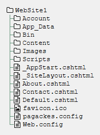
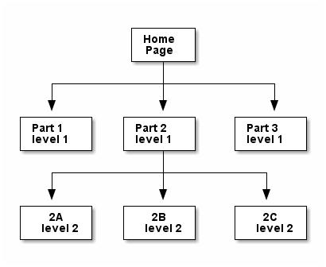
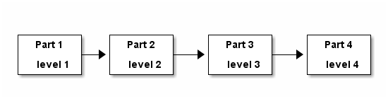

== Web Pages

This text assumes you are already familiar with the client-side languages: HTML, CSS, and JavaScript.

For an excellent CSS reference, download Smashing Magazine's cheat sheet at https://www.smashingmagazine.com/wp-content/uploads/images/css3-cheat-sheet/css3-cheat-sheet.pdf 

For an excellent HTML reference, download Smashing Magazine's cheat sheet at https://www.smashingmagazine.com/wp-content/uploads/images/html5-cheat-sheet/html5-cheat-sheet.pdf

For a JavaScript reference, download both Pam's JavaScript Cheat Sheet at http://thewebivore.com/wp-content/uploads/2013/02/PamsJavascriptCheatSheet.pdf and cheatography's cheat sheet at https://www.cheatography.com/davechild/cheat-sheets/javascript/pdf/

As none of these are creative commons, I have not included them here.

=== ASP.NET 

ASP.NET operates on several levels in our environment.

. It provides the engine on which our C# code runs, the Common Language Runtime. Microsoft has several languages that compile to the binary format understood by the CLR, which is called "Microsoft Intermediate Language", or MSIL, pronounced "missile".

. It provides the infrastucture for understanding and moving around in websites; each page of your website is actually a Page object in ASP.NET, and as such has properties that you can get and set, and actions that you can perform. We will see many such useful objects: Page, Session, HttpRequest, and others as we develop our web applications.

. It provides a rich set of functionality, often referred to as a library, that you can access as actions performed by objects. There is quite a bit of code that you will not have to write because it is already available to you in ASP.NET. For example, "substring" has already been written, and so has "WebMail.Send", which when configured properly will send an email for you.

[NOTE]
====
The ASP.NET library actions can look like function calls at times. However, when a target object is not identified, the current object is implicit. In your .cshtml files, this is the Page object, identifying the current page being rendered in the system.
====

ASP.NET runs within Microsoft Internet Information Services, which is the Microsoft web server. You install your web application within the web server, and when users request pages that reside in your web application, ISS renders them and provides them to the client.

From within Visual Studio, a local IIS Express engine is started up when you "run" your application, and automatically loads and starts your web application at its root page, Default.cshtml. Your machine operates as both client and server, providing both the IIS web server and the web browser that accesses its contents. We will cover deployment to a separate server later, but keep in mind it means that the local file system cannot be assumed to be where your web application lives.

[NOTE]
====
How does IIS know where to find the root page? It looks in the root directory for a file with a recognizable extension (.html, .htm, .aspx, .cshtml, .php even) and with a recognizable file name (Default, Index). Since Windows is not case sensitivie with respect to file names, it could even find defaulT.CSHtml. By convention, our projects always start at Default.cshtml.
====

=== Visual Studio

For this book, I have assembled a template available through the Visual Studio Gallery. This section describes that template's organization, which follows Microsoft conventions.

To start your project with that template, in Visual Studio 2015's menu, choose File -> New -> Project. On the left column of the New Project panel, select Templates -> Visual C# -> Web. 

To install the template the first time, click the link at the bottom of the center panel that reads "Click here to go online and find templates.". In the search box (upper right corner, with the text "Search Online Templates" in it), enter "Identity,Razor". The template named "ASP.NET Web Pages Starter Site with Identity" will appear in the list. Select that template, replace "WebPagesSite1" with the name of your project, make sure "create directory for solution" is unclicked, verify the location for your project, and then click OK. This will create a new project with that template for you. Here is the screen showing that selection:

.First Project in Visual Studio
image::images/VSfirstproject.png[]

All future projects will find ASP.NET Web Pages Starter Site with Identity listed under the Visual C# Web templates, along with the Empty web site:

.Template in Visual Studio
image::images/VSnthproject.png[]

You can select the template there, enter an appropriate Name and Location, and click OK to start from that template in your next projet.

If you choose File -> New -> Project -> C# ASP.NET Web Application -> Empty or File -> New -> Web Site -> ASP.NET Empty Web Site, you will get just a single file (Web.config) and no supporting infrastructure to work with. We will use that for some of our smaller examples, but want to make use of the template site for our more complete projects.

[NOTE]
====
There is a Microsoft-supplied template available in Visual Studio when you create your site with File -> New -> Web Site -> ASP.NET Web Site (Razor v3). This creates you something similar to what is described here, but uses the old user login system of ASP.NET Membership, which relies on SQLCE. This isn't compatible with deploying (Chapter 6) and so we use an alternative template that provides a user login system using the current ASP.NET Identity library.
====

.Web Site Template Tree

////
[tree,file="filesystem-tree-viewer.png",height="+200",width="+100"]
--
WebSite1
|--Account
|--App_Code
|--App_Data
|--bin
|--Content
|--Images
|--obj
|--Scripts
|--_AppStart.cshtml
|--_PageStart.cshtml
|--_SiteLayout.cshtml
|--About.cshtml
|--Contact.cshtml
|--Default.cshtml
|--favicon.ico
|--pagackes.config
`--Web.config
--
////

If there is no App_Data directory, create it by right-clicking on the prject name, and selecting Add -> Add ASP.Net Folder -> App_Data. This ensures the project knows about this special folder.

==== Review of website initial directories

* `Account` holds the pages that access the Microsoft ASP.NET Identity system. This is a basic system, sufficient for our needs, and well-tested from wide distribution. It is unlikely you will need to alter the contents of this directory unless you choose to expand it with Identity plug-ins such as external authentication or two-factor authorization. 

[TIP]
====
The files in `Account` are a great, in-depth collection of code for a single purpose; review their contents as you learn Razor, C#, and ASP.NET until you can understand how they work.
====

* `App_Code` holds some startup code for the identity system (`Startup.cs`). You will add any C# files you create to this directory; the parent directory contains only configuration and Razor-enhanced html files (.cshtml)

*  `App_Data` holds the database(s) for your website; you start out with one for the user accounts, and may add to it or create a second one for your application data. You would also put text data files in this directory. The Identity database is usually stored in a file named `Identity.mdf`, and is created the first time you access the identity system on your website (create a login or attempt to login).

* `bin` contains libraries to make your application self-contained; it is populated by Visual Studio when your C# code is compiled. "bin" is short for "binary", i.e. compiled code -- taken from text to a binary format, MSIL (MicroSoft Intermediate Language), that is understood and executed by the CLR (Common Language Runtime). You never directly change the contents of this directory.

* `Content` contains the CSS used by your web application. It is pre-populated with the CSS used by the template website, which includes JQuery.

[TIP]
====
The `Content` and `Scripts` directories have the same file twice, once with `.min` between the file name and the prefix, and once without. `.min` means "minified", which is a processing of the CSS and JavaScript to remove any unneeded whitespace and compress internal names. This is done to reduce the network traffic required for the website - though it also makes the files pretty unreadable.
====

* `Images` contains the image files used by your web application. It is pre-populated with the images used by the template website.

* `obj` contains the compiled files before they are packaged up and put in the `bin` directory. You should never need to directly alter the contents of this directory.

* `Scripts` contains the JavaScript used by your web application. It is pre-populated with JQuery, Knockout, and Modernizr, three well-known frameworks used by the template website.

==== Review of website initial files

[IMPORTANT]
====
Only the top-level files are discussed here; the ones within the directories are mentioned in the previous section.
====

* `_AppStart.cshtml` contains HTML that is executed at the first request of any page in the site. (Not each page, the very first request only.) It is used if you have application-wide setup or values to prepare.

* `_PageStart.cshtml`. This will let us use a common layout among our pages.

* `_SiteLayout.cshtml` sets up to use the Web Pages templating convention, complete with a common title bar for user account login/registration and the outer tags of any HTML page. This is a powerful tool, used to give all of your pages a common look and feel.

* `About.cshtml`, `Contact.cshtml`, and `Default.cshtml` are template pages provided to jump-start your website. You can see that they are not stand-alone HTML pages; they rely on Web Pages integrating it with _SiteLayout.cshtml and _PageStart.cshtml to become complete web pages.

[TIP]
====
You may be wondering where the Login pages are? They are in the `Account` folder. It is common to organize a website so that separate portions are kept in their own subdirectories.
====

* `favicon.ico` is a small image file used as the icon in the web browser's tab bar for your website. It must be a 16-pixel by 16-pixel bitmap file; you can create them, or edit this one, in Microsoft Paint or from within Visual Studio.

* `packages.config` lists all external packages your web application depends on.

* `Web.config`, you may notice, appears to be both a file and a directory. In File Explorer, you will find it is just a file, and that there are two more files right after it, `Web.debug.config` and `Web.release.config`. The debug file sets up additional parameters for removing items you don't want visible in production code such as stack traces. `Web.release.config` does the opposite, removing configuration that makes a website easier to debug but less secure.

=== Web Pages Layouts

The layout structure supplied in Web Pages makes it easy to have a common template within which your pages appear. 

This is a good thing, as it lets you give your website a consistent look without having to repeat the HTML across all the files.

Web Page Layouts let you lay out a "parent file" that specifies the layout of all your pages as well as separate header and footer files pulled in for your pages. You can isolate down portions that need to be the same and portions that need to change.

.Don't Repeat Yourself
[TIP]
====
This Web Pages feature embodies an important programming concept: D.R.Y.: Don't Repeat Yourself. (oops)
====

Layouts are done using the ASP.NET library. This requires that you learn the first step of Razor: how to embed an ASP.NET function call in your code.

This is done by prefixing the function call with the @ symbol.

=== Layout Functions

Here are the ASP.NET functions used to manage layouts:

.ASP.NET Layout Functions
[options="header"]
|=======================
|Function|Example|Description
|RenderPage    |@RenderPage("header.cshtml")     |Finds the named page and pulls its contents in to the current location.
|RenderBody   |@RenderBody()     |Pulls in the main HTML from the file this template is being applied to.
|RenderSection   |@RenderSection("help", required:false)     |Pulls in the named section from the file this template is being applied to; if required is true or not specified, the section must exist.
|=======================

==== Identifying the Template

You get the template by creating a layout file (_SiteLayout.cshtml is the one supplied) and then having a _PageStart.cshtml that identifies it in a Razor code block, like so:

[source,java]
----
@{
    Layout="~/_SiteLayout.cshtml";
}
----

This is doing several things:

* @{..} embeds a C# code block -  this is our second Razor construct.
* Layout=... is a C# assignment statement that assigns a value to the page Layout property, which will cause the template to be pulled in and used along with the contents of this file. Layout is a page property, which says what layout to use for the page. That layout file will contain instructions on how to use the rest of the content of your page.
* "~/_SiteLayout.cshtml" is a C# string value that will be used to find the template file. This one in particular uses the ASP.NET convention for a file name, ~ represents the root directory of the website. You should always use either ~ rooted references or relative references, since your website's location in a particular directory is not guaranteed and will be different in deployment than in development.

[TIP]
====
Alternatively to using a _PageStart.cshtml, you can have each page in your site set the Layout variable directly in a Razor code block at the top of the file. This lets you have a different layout for each page if you want it -- but usually it's best to have one layout shared among the files in your site, for a consistent experience.
====

==== Identifying a section

You identify a section named help within your .cshtml file like so:

[source,html]
----
@section <1> 
  help <2> 
{
  
If you are looking for assistance with this web site, please contact admin@website.com.
 <3>
}
----

<1> @section is the Razor marker to make this portion of your file a section; it will only be rendered if there is a matching @RenderSection call in the layout file.

<2> This is the name of the section; you can give your sections any valid identifier.

<3> The section begins and ends with curly braces; within you place HTML and potentially embedded Razor blocks.

=== Making Layout Setting DRY

You have seen that you can apply different layouts to different pages in your website by setting the `Layout` property at the start of each page. However, what if you forget one page?

This is handled at a directory-wide level with a _PageStart.cshtml file. When a target page is identified, a _PageStart.chtml file in the same directory is read and rendered before the file for the page itself. So you can ensure that all the files in a given directory use the same layout file by creating a _PageStart.cshtml file that sets the Layout property like so:

._PageStart.cshtml
[source,java]
----
@{
  Layout = "~/SiteLayout.cshtml";
}
----

You can put any other common processing in that file as well.

If you need to override the Layout property for a single file in the same directory, you can reset it at the start of your individual .cshtml file -- it will change the property's value onces _PageStart completes and your actual page begins rendering.

If you create a subdirectory, you would create a _PageStart.cshtml file in it to have each page in the new subdirectory use the same Layout.

==== Other uses for _PageStart

_PageStart can be used for more than just selecting a common layout: it lets you specify any common action you desire. This might include 

* initializing Page properties
* specialized error handling
* restricting folder access

See http://www.asp.net/web-pages/overview/ui-layouts-and-themes/18-customizing-site-wide-behavior for examples of those uses.

==== Subdirectories?

I mentioned earlier that subdirectories are often used to separate different sections of a website. In the template provided, we see the `Accounts` directory contains all of the code for user accounts, login and registration, separate from the rest of the web site.

Within a directory, ASP.NET will look for a _PageStart file to use prior to rendering the file within the directory that you have requested.

=== Web Design

Layouts are simply a tool; the key task behind them is designing your web application. We are looking at web applications that would have several pages, would be accessed by a variety of people (this is the internet, after all), and involve persistent data kept on the server.

==== Learn from the Internet

You probably already have favorite places on the internet -- consider what you like about them, and how they are organized. You can always take a peek at how they did their HTML with a simple right-click and View Source... on the pop-up menu that appears. You won't see their client-side code, but you will see their HTML, and any links to additional CSS and JavaScript files there can be clicked on to bring those up as well.

When you do this, remember: there is an implicit copyright on anything you see on the internet, unless they have released it with an explicit statement or license such as Creative Commons (for content) or Open Source (for code). You can't simply copy and paste what is there, you need to learn from it, internalize it, and then put it aside when you work on your own web applications. Copying code is a copyright violation, and in the workplace can be grounds for losing your job or legal prosecution.

==== Responsive Web Design

A current theme  in web design is to have your site be responsive; in fact, this replaced the prior theme of "mobile-ready" web sites. Razor provides some capabilities for "mobile-ready" -- we will not be discussing them in this text. To make your web site responsive regardless of its target client, use the CSS/Javascript framework called Bootstrap. This framework is included in ASP.NET MVC projects due to its rich capabilities. 

Bootstrap is outside the scope of this text; for more information, I recommend:
http://getbootstrap.com/getting-started/[the official bootstrap resources] and the http://www.tutorialspoint.com/bootstrap/[Tutorials Point Bootstrap Tutorial].

==== Basic Design Principles

Good design starts and ends with the user: is your website usable. Yes, it has a purpose; it is your job as its designer to mold that purpose into a positive user experience. As developers, we often forget to look at the user and get lost in the purpose. So, design focuses on the user perspective, as you see in the list below.

[quote,Charles Eames]
Design is a plan for arranging elements in such a way as best to accomplish a particular purpose.

===== 1. Don't make users think

Make it easy for users to "do the right thing" -- you want them to stay on your site and enjoy it. This means inviting them to push the right button, not making them click several times where one click will do.

There are a few things to know about users that can help you with this:

* users know quality when they see it; if they hit typos or things that don't work, you've lost them.
* users scan: don't overload them with text; you are making a website, not a book.
* users are impatient, and that means they will choose early rather than look at all the options.

===== 2. Don't waste users' time

This can be anything from slow load times to requiring several clicks where one would do. Right-size your images for the web, and consider mobile load times; you can tailor images to several platforms with CSS media rules.

Also consider not having them register at first -- get them interested in your site so that they want to register. When you _do_ make them register, don't ask them for more information than you need. Privacy is important to users, and they may leave your site if you ask for irrelevant information.

Consider how you want your website to flow; different parts may need different flows -- think about the user experience and what they will expect, to make them as intuitive as possible.

Two typical flows are *hierarchical*, where you drill down to more detail on a particular item; and *sequential*, where you step through a series of equal items. E-books are often a collection of both; the book opens to a table of contents that lets you drill down to particular chapters, and chapters drill down to sections. Once you are on text, you can move sequentially from page to page.

.Hierarchical flow

////
[uml,file="hierarchical.png"]
--
@startditaa
              +-------+
              | Home  |
              | Page  |
              +---+---+
                  |
    +-------------+-------------+
    |             |             |
    v             v             v
+--------+   +--------+    +--------+
| Part 1 |   | Part 2 |    | Part 3 |
| level 1|   | level 1|    | level 1|
+--------+   +----+---+    +--------+
                  |
    +-------------+------------+
    |             |            |
    v             v            v
+--------+   +--------+    +--------+
|   2A   |   |   2B   |    |   2C   |
| level 2|   | level 2|    | level 2|
+---+----+   +--------+    +--------+

@endditaa
--
////

.Sequential flow

////
[uml,file="sequential.png"]
--
@startditaa

+--------+   +--------+    +--------+    +--------+
| Part 1 |   | Part 2 |    | Part 3 |    | Part 4 |
|        +-->|        +--->|        +--->|        |
| level 1|   | level 2|    | level 3|    | level 4|
+--------+   +----+---+    +--------+    +--------+

@endditaa
--
////

Website layout is often done with a "wire diagram" showing how the pages are interconnected. Cloud tools such as http:///www.cacoo.com/[Cacoo] and freeware such as http://pencil.evolus.vn/[Pencil] are great tools for layout out your website before you commit to HTML.

===== 3. Keep it simple

Choose simple words, keep phrases and text short and focused. Technical writing is an art in itself. Remember to focus on avoiding spelling errors and also on using active voice.

[TIP]
====
What is _active voice_?  Write as if you were talking to your user, and use direct language. For example, instead of saying "at this point in the installation one may see that the icon is changing colors", say "now you see the icon change color". Active voice is tight, crisp, and direct.
====

Your layout should also be simple; don't overload the user with flashing icons, lots of fonts, and random color changes. Keep it clean and crisp -- keep it simple. In this regard, white space is your friend. Look at websites you like -- see where they put gaps, around headers, around images, between sections on their pages. Strive to use whitespace to add organization and direction to your site.

===== 4. Make the right choice obvious

Each page should have one goal; and users should be able to figure that out and satisfy that goal quickly. Focus the user's attention on the key activity the page wants them to do.

Guide the user -- you may feel like you are oversimplifying things, but remember, they will decide to stay on your site or not in three seconds.

There is some great advice on this here: ttp://conversionxl.com/8-universal-web-design-principles-you-should-to-know/

===== 5. Use layout carefully

There should be a consistent look to all of the pages in your application. That layout needs to consider that it is on all of your pages. Keep common features such as links to a privacy policy, out of the way but available. Navigation is usually at the top of a page, links to common pages at the bottom.

HTML provides you with the ability to change font sizes and font families easily. Do this with care. Use the semantic tags appropriately, so <h1> is your largest, most important heading and <h6> is your smallest, least important heading. It's seldom appropriate to have more than 2 levels of headers, actually, as users won't stay engaged long enough if they need to keep the upper levels in mind to know where they are.

Step away from your monitor to view the page from a distance -- is there a visual clue there that aids the user in finding out what to do, without being able to read the text? There should be.

===== 6. Don't be unconventional

Sure, it's fine to work on being a break-out designer with the newest look. But when you are creating something that is new-but-not-new, such as a website to sell shoes, consider what the biggest in the business do: zappos.com has this down. Now, you can't copy their site, but you can learn from it: where do they put their privacy policy? what order are their shopping cart check-out steps in?  You will soon find that websites that sell things (even non-shoe things) have a pretty standard order for cart check-out. It would be to your benefit to use the same order. That way users won't get lost, and you will get the sale.

Even a game website has some conventions: there will be help links, inventory pages, pages to shop for extra goodies, and the basic game play page.

There are conventions for web pages that are there for very good reasons, such as https://www.webaim.org/[WebAIM]'s guidelines for accessibility. When you learn about conventions such as those, use them. It will help your web site if more people can use it. Some conventions may actually be a legal requirement for your website: accessibility, copyright, terms of service, and privacy policies are becoming more mandatory, with legal requirements in some fields such as education and government web sites.

=== Further Reading
- http://www.asp.net/web-pages/overview/ui-layouts-and-themes/3-creating-a-consistent-look[Creating a Consistent Layout in ASP.NET Web Pages (Razor) Sites] @ asp.net
- http://www.asp.net/web-pages/overview/ui-layouts-and-themes/18-customizing-site-wide-behavior[Customizing Site-Wide Behavior for ASP.NET Web Pages (Razor) Sites] @ asp.net
- http://www.w3schools.com/aspnet/webpages_layout.asp[ASP.NET Web Pages - Tutorial] @ w3schools.com
- https://www.smashingmagazine.com/2008/01/10-principles-of-effective-web-design/[10 Principles Of Effective Web Design] @ smashingmagazine.com
- https://www.smashingmagazine.com/2012/01/stop-designing-pages-start-designing-flows/
- https://www.smashingmagazine.com/2012/01/stop-designing-pages-start-designing-flows/[Stop Designing Pages And Start Designing Flows] @smashingmagazine.com
- http://conversionxl.com/8-universal-web-design-principles-you-should-to-know/[8 Effective Web Design Principles You Should Know] @ conversionxl.com
- http://conversionxl.com/how-to-design-user-flow/[Buld it With the User in Mind] @ conversionxl.com
- http://www.digital-web.com/articles/principles_of_design/[The Principles of Design] @ digital-web.com
- https://www.webaim.org/[WebAIM: Web Accessibility In Mind] @webaim.org
- https://msdn.microsoft.com/en-us/library/hh145667[Exercise 1 - Creating the Base Application from a Template] @ msdn.microsoft.com builds a sample website in WebMatrix using layouts

=== Exercises

. Design a layout that mimics craigslist.org: a home page with links to sections, section pages with links to individual items, and individual item pages. Develop a wire-frame and then implement your layout in Web Pages.   Include at least 3 sections and 6 items (it is fine to cross-list items in multiple sections). Have a common look-and-feel, and capture it in +_SiteLayout.cshtml+. Use +_AppStart.cshtml+ and +_PageStart.cshtml+. Use the Web Pages convention of ~ as the location of the root directory of your website, not an absolute path.
+
This will be a hierarchical layout (with a little spaghetti at the lowest level if you reuse item pages).

. Design a layout that mimics a shopping cart purchase process: a cart page showing contents, and includes at least three steps in the process.
+
Consider what you want displayed on each page, and why you chose the steps and the order in which you present the steps (was it modeled after a well-known website? what reasoning did you use in putting the pages in the order you chose?)
+
Design a wire-frame and then implement your layout in Web Pages. Have a common look-and-feel, and capture it in +_SiteLayout.cshtml+. Use +_AppStart.cshtml+ and +_PageStart.cshtml+. Use the Web Pages convention of ~ as the location of the root directory of your website, not an absolute path.
+
This will be a sequential layout.

=== Project

Design a layout for your application. Use the Layouts and Render, and start with the default Razor 3 application so that user logins are a part of your website. Rewrite the About and Contact pages. Make the contact information reflect how you would like to be contacted - only include information for the methods of contact you want to respond to. Use a _PageLayout.cshtml file so that you do not repeat the code to set the Layout property in every page.

Start looking into Geolocation in HTML, using this: http://apress.jensimmons.com/v5/pro-html5-programming/ch5.html

and this: https://developers.google.com/maps/

Make a You Are Here webpage that shows the user's current location by latitude and longitude.
Or go for it, and show it on a map. Be sure to include a citation of sources used in your HTML.
To display a map you will have to have a google account so that you can get a Google Maps key. This is available at no charge at the google link above. (Bing also has a map service, if you prefer using a Microsoft account; theirs also requires a key.)