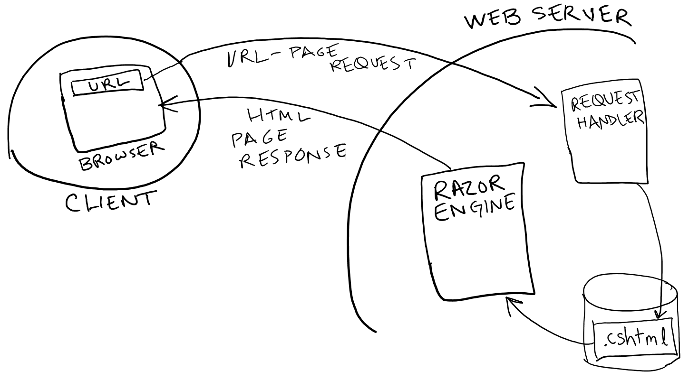

== Razor

Believe it or not, you've already seen almost enough Razor to infer how it is used to embed C# within a web page.

Let's take a step back and review what's going on:

.Where Razor fits in the web request processing

When a client requests a particular page, the web server determines how to "source" it -- it may be a file (as ours are) or it may be an interface to another system. It locates the file, and then determines if it needs further processing before it is returned. 

A web browser (in the client) can only handle HTML, CSS, and JavaScript, so anything beyond that needs to be turned into one of those three on the server. So, when the web server realized the page has Razor in it, it hands it to the Razor engine. That engine will execute the code within the Razor markers, which may impact the server-side state and may also cause HTML to be generated within the page. Once the processing completes, the final HTML page is returned to the client for rendering in the web browser.

Razor is a templating "language": it defines how to note that you are now in C#, which needs to be executed on the server side. Razor is used for two reasons:

. to impact server-side state
. to generate in-place HTML within the page

Its rules are fairly basic and intuitive, and just like we can use parentheses to clarify order of operations, Razor gives us several ways to make very clear when we are specifying client-side code (HTML, JavaScript, and CSS) and when we are specifying server-side code (C#).

[NOTE]
====
Yes, Razor can also be used to embed Visual Basic. We won't go there. To see those rules: http://www.asp.net/web-pages/overview/getting-started/introducing-razor-syntax-vb
====

=== Razor's Rules

.1. Use the file extension .cshtml
To tell the web server that your page has Razor and C# in it, you give the file the extension .cshtml. That's all.

If your page in fact has no Razor/C# in it, it works fine. The processsor won't find anything to process, and simply returns the file unchanged.

.2. `@{ ... }` marks a code block.

To put a block of C# code in your file at the point you want it executed, you open the block with `@{` and close the block with `}`. Everything within is considered to be C# and is interpretted as such. The contents must follow the rules of C# (but note #4 below).

[source,java]
----
<!- - Multi-statement block - - >  
@{  
var weekDay = DateTime.Now.DayOfWeek;  <1>
var weekDayMessage = "Thank goodness it's " + weekDay;  
}  
----
<1> the variable weekDay is looking into an ASP.NET object named DateTime. The "." operator on DateTime accesses a property called Now, which is then accessed with another . operator to get its DayOfWeek property. That holds a string value which is, you guessed it, the day of the week when the code is executed.

.3. `@` marks an inline expression.

If you want a simple value in your HTML, you can slip into C# mode with a simple @ symbol. The expression is evaluated by the Razor engine and its value put into the resulting output HTML file.

Typically the @ is used with a variable previously declared in a code block, or with a function call. It can also be an arbitrary expression, wrapped in parentheses.

ASP.NET provides many useful functions; you saw this with the `@RendorBody()` method used in Layouts. 

[source,java]
----

Hello. @weekDayMessage
 <1>

Did you know that 1 + 1 is @(1+1)?
 <2>
----

<1> Assuming the code block above occurs first, this will substitute the string in place of the variable when the page is processed in the web server, so on a Monday, the resulting HTML will be the code shown below.

<2> And yes, `@(1+1)` is a bit silly but shows the use of parentheses around an expression.

[source,java]
----

Hello. Thank goodness it's Monday

Did you know that 1 + 1 is 2?

----

.HTML Encoding
[CAUTION]
====
The @ marker has a very interesting and valuable side-effect. The content that is put is is "HTML encoded". ASP.NET replaces reserved HTML characters with codes that will display the character in the web page rather than let them be interpretted as HTML. This is valuable because it prevents a security hole with user data called an "injection attack", where user data causes execution on the web page.

So, characters such as ``<``, ``>``, and ``&`` will be replaced with numeric entity references and will be displayed as text, rather than coming through unchanged in a string value.

If you want to have the string value appear as raw HTML, un-encoded, you will need to wrap the value in an ASP.NET function such as Html.Raw().
====

.4. Declare variables with the `var` keyword.

This is one slight difference from C# general use, where variables are usually given types.
Razor expects a more dynamic environment, so variables are declared simply with `var` and their type is inferred from their initialization. 

C# does require the variables be declared, unlike PHP and other weak-typing languages.

[source,java]
----
@{ var total = 7; } <1>

The value of your account is: @total 
 <2>
----

<1> total takes an integer value
<2> the value in the variable is put in its place in the resulting HTML.

The variable must be both declared and initialized, so that its type can be inferred from the initial value.

.5. C# is case sensitive.

This is true in C# in general, and applies here as well. C# keywords and names are always case sensitive. The name you access a variable with must match the case of how it was declared. `lastName` and `LastName` do not match.

.6. Statements end with semicolons.

If you use @ to start a statement, end it with a semicolon. (We won't see an example of this until we get to more complex features requiring @using.)

Within code blocks, the normal rules of C# apply, where statements usually end with ; and compound statements are surrounded with { }.

.7. To put @ in your HTML, use @@.

How do you put an email in a HTML file?  like so:  me@@gmail.com. @@ is replaced with @ by the Razor engine.

.8. String values use quotation marks

Strings use the double-quote, or " mark, in Razor blocks and expressions.

We look to C# to see how to handle all the lovely corner cases with strings that always occur in a language:

C# requires \ (backslash) and " (the double quote) be handled with special string literals.

To put a \ in a string, you have to prefix the string literal with a @ marker. This is a C# @, not a Razor @. C# calls this a __verbatim string literal__. This is because the \ marker is used to include character encodings in string literals.

[source,java]
----
<!-- Embedding a backslash in a string -->
@{ var filePath = @"C:\MyFolder\"; }

The path is: @filePath

----

To put a double quote within a string, you use the verbatim string literal and double up the double quote, like so:

[source,java]
----
<!-- Embedding double quotation marks in a string -->
@{ var quote = @"Then she said, ""Hello, how are you?"""; }

@quote

----

This renders as:
[source,HTML]
----

Then she said, "Hello, how are you?"

----

To continue a long string value across multiple lines, start with a verbatim string literal opening (`@"`) and then wherever you have newlines they will be ignored. Close the string with `"`.

.9. ASP.NET Objects are available to you in code blocks and inline expressions.

Even before we start declaring our own objects in C#, you will be working with many ASP.NET objects. You have already done this with layouts: the RenderBody, RenderSection, and other functions are actually methods on the Page object available by default in a page.

Objects have properties that describe their characteristices and methods that define actions on the object. You can read or change an object's properties and call its methods.

Besides the Page, you will have access to the Request that came in for the page, and many other system objects such as the DateTime object we've used already in our examples.

The Request object is an interesting one to explore:

[source,java]
----
<table border="1">
<tr>
    <td>Requested URL</td>
    <td>Relative Path</td>
    <td>Full Path</td>
    <td>HTTP Request Type</td>
</tr>
<tr>
    <td>@Request.Url</td> <1>
    <td>@Request.FilePath</td> <2>
    <td>@Request.MapPath(Request.FilePath)</td> <3>
    <td>@Request.RequestType</td> <4>
</tr>
</table>
----
<1> The Url property gives you the URL of the page
<2> FilePath gives you the path on the URL (after the domain name)
<3> MapPath is a method on Request that gives you the absolute path of the page on the server
<4> RequestType tells you if it was a GET or POST request.

.10. Everything outside the Razor markers is HTML.

So, HTML comments are used in HTML, and C# comments are used within Razor blocks.

.11. Put HTML inside Razor blocks with @: or <text>

You can actually include HTML within a Razor block by using any matching tags; the <text> tag is specific to Razor, but HTML tags such as 
 and <em> can also be used.

A single line of HTML can be included with @: at the start of the line.

You can also use inline expressions within those "HTML-inside-Razor" blocks - this can get confusing fast, so use this type of embedding carefully.

[source,java]
----
@{
    var minTemp = 75;
    
    <text>It is the month of @DateTime.Now.ToString("MMMM"), and
    it's a <em>great</em> day!  
You can go swimming if it's at
    least @minTemp degrees. 
</text>
    
    @: It is @DateTime.Now.DayOfWeek. <1>
    
    
We can just use the HTML markers too. And inline a value: @minTemp.

}
----
<1> You might notice the closing . here -- why doesn't Razor consider it to be a dot operator? because there isn't a valid name following it. Razor keeps following dot operators as long as they are followed by names, but when they aren't, it stops and assumes the . is part of the HTML, not part of the inline expression. Razor's really clever that way.

.12. You can embed the C# if statement directly.

The C# if can be directly embedded with the @ operator rather than inside a code block. This may remind you of PHP, which does something similar:

[source,java]
----
@if(IsPost) { <1>
    
Hello, the time is @DateTime.Now and this page is a postback!
 <2>
} else { <3>
    // All content between matched tags, followed by server code. <4>
    
Hello <em>stranger</em>, today is:   
  @DateTime.Now
}
----
<1> IsPost is a property on the page which is true if the request was a POST of a form.
<2> This is HTML within the code block.
<3> Notice that the else uses curly braces but no additional @ symbols.
<4> The // is used to make a C# comment within the block.

.13. Razor comments use @* *@

Yes, you have HTML comments in your HTML.
Yes, you have C# comments in your code blocks.

You also have a third choice, which can be used in both places: Razor comments.

Razor comments are __removed__ by the Razor processor, so they will not be seen on the client. HTML comments are seen on the client.

==== Is that it?

There are a few more uses of Razor that we will see, such as @using, but we will explain them when we have enough context to make them useful.

Razor itself is a small set of conventions that allow you to embed C# within HTML. So alot of our "Razor" rules above are actually C# rules (verbatim string literals, variables, and case sensitivity, for example).  Helpers are also considered to be part of Razor; we saw some in Layout with the various Render calls that pull pages together from layout templates.

Razor also is used as a base in ASP.NET MVC, the next level of Web Development technology in the Microsoft stack.

I know Stack Overflow is a favorite landing pad when there are questions, but Microsoft Developer's Network maintains forums that you may find useful, specifically the * http://forums.asp.net/1224.aspx/1?ASP+NET+Web+Pages[ASP.NET Web Pages] forum.

=== An example: a simple calculator

Based on http://www.asp.net/web-pages/overview/getting-started/introducing-razor-syntax-c[Introduction to ASP.NET Web Programming Using the Razor Syntax (C#)]

.SimpleCalculator.cshtml
[source,java]
----
@{
    var result = 0;
    var message = "";
    if (IsPost) {
        // Retrieve the numbers the user entered.
        var num1 = Request["num1"].AsInt(); <1>
        var num2 = Request["num2"].AsInt();

        // Add the numbers and provide the result message
        result = num1 + num2;
        message = "Total = " + result;
    }
}

<!DOCTYPE html>
<html>
  <head>
    <title>Simple Calculator</title>
    
    
  </head>

  <body>
    
Enter two integers and then click <strong>Add</strong>.

    <form action="" method="post"> <2>
      
<label for="num1">First Number:</label>
        <input type="text" name="num1" />
      

      
<label for="num2">Second Number:</label>
        <input type="text" name="num2" />
      

      
<input type="submit" value="Add" />

    </form>

    
@message
 <3>
  </body>
</html>
----
<1> The `Request` object is used to access a form's fields. Since field names are dynamic, the `[...]` syntax is used with the field name to get to the form field value, rather than dot notation. The values are available as strings, so the .AsInt() method is called on the string value to conver it to an integer.
<2> Notice ``post`` here -- that ensures when submit is clicked, the request is a post request, so IsPost is true in the C# code when the form is submitted. The original page request will be a get request.
<3>The result message is completely filled out in the message variable so that no text is output if the user has not yet submitted the form. An empty paragraph will be output before the form is submitted.

.GET and POST in HTTP
[NOTE]
====
HTTP requests are usually GET requests; forms can be submitted with either GET or POST. We use POST here so that we can use IsPost to determine that the form has been submitted (it keeps our code simple). POST is also used for long forms, to put the form values in the HTTP request rather than within the URL. A GET submission causes the values to be placed within the URL itself Google does this - check out the search URL next time you do a search.They use GET so the search result can be bookmarked. Since you set up the form, you get to decide how it will be submitted. This lets you handle form processing appropriately.
====

One thing our page lacks is error handling; we will see that there are calls we can make to check the input values and ensure they are valid integers prior to converting them to integers. There are several checks we may want to make, if our code is going to be used to control peoples' bank balances or fly shuttles to Mars. (Don't believe me? see http://www.hq.nasa.gov/office/pao/History/alsj/a11/a11.1201-pa.html)

=== Further Reading

* http://www.w3schools.com/aspnet/razor_syntax.asp
* http://www.asp.net/web-pages/overview/getting-started/introducing-razor-syntax-c
* http://www.asp.net/web-pages/overview/getting-started/introducing-aspnet-web-pages-2/getting-started
* http://www.asp.net/web-pages/overview/getting-started/introducing-aspnet-web-pages-2/intro-to-web-pages-programming
* http://www.asp.net/web-pages/overview/testing-and-debugging/aspnet-web-pages-razor-troubleshooting-guide
* http://www.asp.net/web-pages/overview/getting-started/aspnet-web-pages-razor-faq
* http://forums.asp.net/1224.aspx/1?ASP+NET+Web+Pages
* https://msdn.microsoft.com/en-us/library/gg606533(v=vs.100).aspx
http://blog.slaks.net/2011/01/dissecting-razor-part-1-pieces-of.html and Slak's other posts on Razor - very informative, something to return to once you've had some time with Razor.

=== Exercises

. The http://www.asp.net/web-pages/overview/getting-started/introducing-aspnet-web-pages-2/getting-started[Introducing ASP.NET Web Pages - Getting Started] tutorial steps you through a "hello, world" style razor page. Complete this walkthrough in Visual Studio (just this page's information, not the pages that follow).

. The http://www.asp.net/web-pages/overview/getting-started/introducing-razor-syntax-c[Microsoft Introduction to Razor] page steps through several code examples. Take the one called "Add Numbers" and get it working in Visual Studio.

. The https://msdn.microsoft.com/en-us/library/gg606533(v=vs.100).aspx[Walkthrough: Creating a Web Site using Razor Syntax in Visual Studio] walks through one example, adding to it as it goes. Do the walkthrough starting after the VS update (with VS 2015 you already have Razor), and get the final page working in Visual Studio.

=== Project

. Forms are a big deal -- they bring a website to life, getting input from the user for a tailored experience in the app. In this chapter you were given a simple example that processes form results on the same page as the form. Build a form that collects interesting data from the user, and have it route its results to a _different_ page that then processes and displays the data entered. You can use either GET or POST as the action, since the target page is only used to process form results. It will not need to check IsPost, it can assume there is a Request with the values available.  Make your form be something you might want to collect data about, such as movies, a bucket list, songs, goals, magic cards, pokemon, flowers, birds, yarns, or beers. You can use this  later in your project when you have a backing database.
