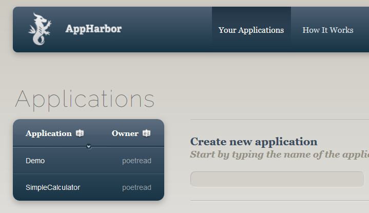
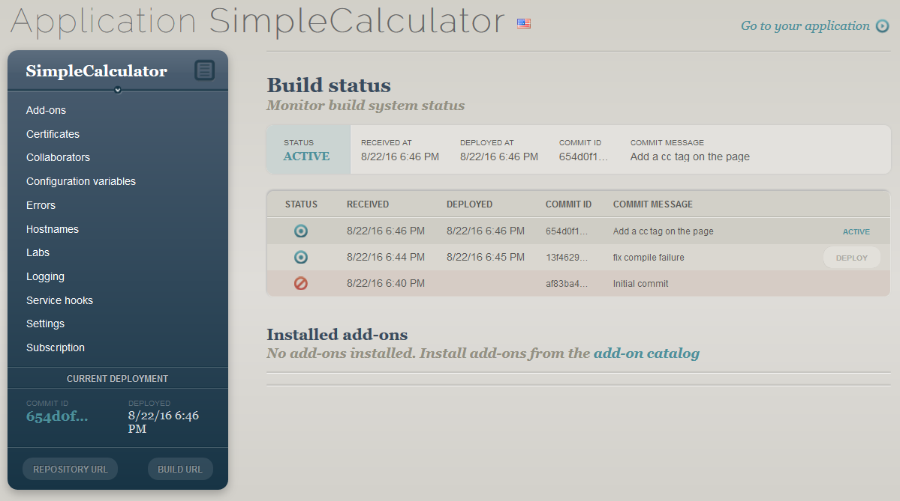
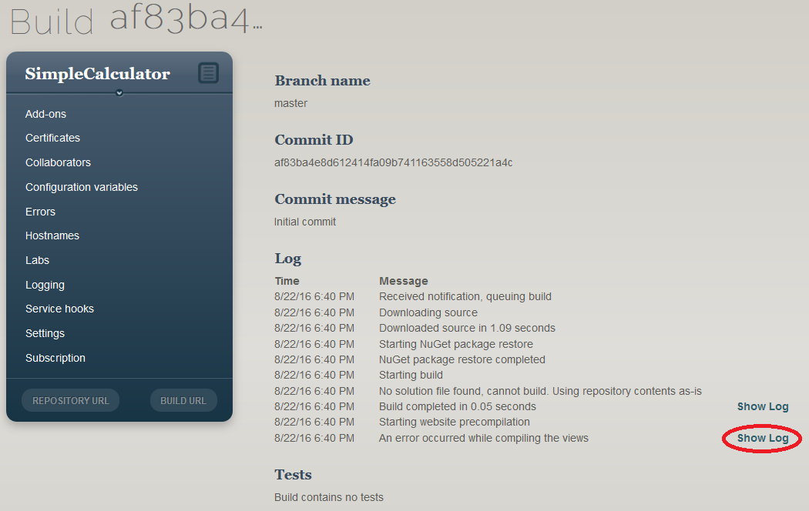
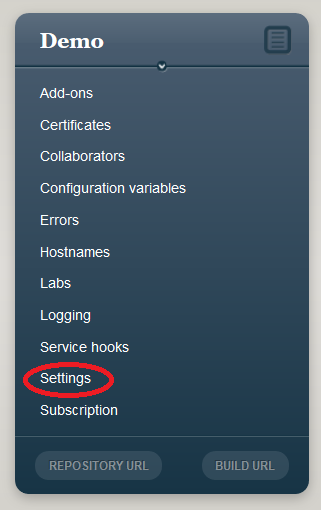
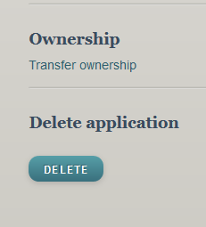
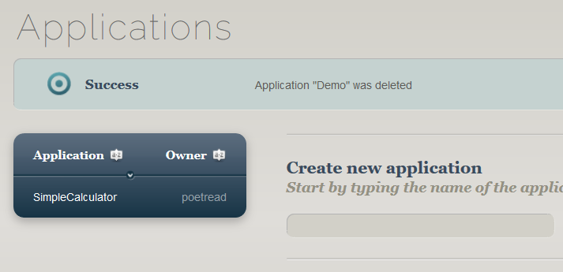

== Deploying Web Page Applications

Your web application isn't live until it's actually on the internet. So far, we've been running our website on the same machine as our browser; that's highly unrealistic -- and may have lead you to take non-viable shortcuts such as absolute paths and security loopholes.

In this chapter we will deploy our web applications so that we can test for any defects due to our assumptions. We will explore security issues in a later chapter.

You've probably heard of the cloud at this point in your studies. We will deploy our web applications to a cloud provider that lets small applications like ours be deployed for free. This will require creating an account -- so read through the privacy policy and ensure you are comfortable with it.

What can you do if you do not want cloud deployment? That's a much larger task, outside the scope of this text. You would need to set up an IIS server on a computer that is visible on the internet, with a fixed IP address and domain name, so that you could put your application on it and your users could find it.

=== Choosing a service

Most services have free trials, but cost money after the first few weeks. There is one, at the time of this writing, that is free for one application at a time: appharbor.com.  Read their terms of service https://appharbor.com/page/terms before you create your account (which is free) at https://appharbor.com/ .

Creating an account requires only a valid email address; you will be required to use a link provided to that email address to complete your registration.

It's important, when using a cloud service, such as AppHarbor, to be aware of any requirements they put on your application. AppHarbor in particular requires that if you have user accounts, you inform the user that the information is available to both your application and to AppHarbor. Also, as is common among cloud services, AppHarbor reserves the right to use your application in their advertising.

Because you are deploying to the cloud, you must not violate anyone's copyright, per the Digital Millenium Copyright Act. Disney is well-known for going after anyone putting Disney images on their pages. Keep it safe, use wikimedia commons, flickr commons, or use your own images (photos or drawings). Yes, this may make your pages not look as good without an authentic Mickey Mouse image, but your future employers may actually come across your web application (especially if you put it in your portfolio), and will appreciate that you respected copyrights rather than "borrowing" images, text, or code. If you really feel the need to re-use copyrighted material, be sure it falls within general fair use guidelines, not academic fair use, which is more lenient, but only pertains to material kept in the school setting.

=== Platform as a Service

AppHarbor is a way for you to publish your application and make it available on the internet. They provide the ASP.NET platform as a service.

AppHarbor takes the source for an ASP.NET-based website and builds, tests, and deploys it. You provide your source to AppHarbor using a software versioning system (Git, Mercurial, Subversion, or Team Foundation Server) to provide a stable version of your software to AppHarbor. 

AppHarbor then builds your code locally. Why? This way it can compile to its host operating system and available libraries, and not rely on being compatible with your local build and system setup. It also has hooks to run unit tests if you provide them, so you can stop a deployment if the tests do not pass.

If the build and tests succeed, then AppHarbor will deploy your application: install it and make it available through an IIS server. It will do all of this for free, giving you one "worker thread". You purchase additional worker threads and services such as databases, caching, and e-mail if you want to, for scaling or more functionality; we won't purchase any for our projects.

AppHarbor can scale your application across CPUs, disks, and servers to provide better performance and reliability (for a fee). This means it could actually run within several different instances, and have copies of its data on several different disks, to allow more users to access it and to provide failover should a disk go bad.

When your web application is live, it is available through a free subdomain of apphb.com or a domain name you've purchased and configured (for a fee). 

AppHarbor is actually running within Amazon Web Services -- so their service layer is the ASP.NET configuration and management, and how they choose to do scaling and services within the AWS infrastructure. (AWS provides direct ASP.NET support as well.) Your application is running in the same server as other applications, but AppHarbor isolates different applications from each other.
      

For more information, visit https://appharbor.com/page/how-it-works

The basic setup can be found in a variety of services like this; ASP.NET C# cloud service include:
* AppHarbor
* http://azure.microsoft.com/[Microsoft Azure]
* http://docs.aws.amazon.com/gettingstarted/latest/wah/web-app-hosting-intro.html[Amazon Web Services for ASP.NET]
* http://www.moncai.com/[Moncaí] (in beta)
* many ISPs offer ASP.NET support, from monolith GoDaddy to smaller shops
* and, via https://www.docker.com/[Docker], a wide variety of hosting services are available

=== Deploying on AppHarbor

AppHarbor provides instructions for deployment here: https://support.appharbor.com/kb/getting-started/deploying-your-first-application-using-git

This requires that you have Git installed on your machine. Git is code versioning/repository software that manages source code.

Once you have an AppHarbor account (created at https://appharbor.com/[appharbor.com]), follow these steps:

1. Log in to your account at https://appharbor.com/[appharbor.com]

2.  Create an application at https://appharbor.com/applications[appharbor.com/applications]. You will pick a name for the application -- call it the same name you gave your application (not Default, but "SimpleCalculator", for example).

3.  Once the application is created, you are on the application page. The box on the left that has the application name at the top has a button "Repository URL" on the bottom. Click that box, and then get the AppHarbor respository URL that is provided. It will look something like this: ``https://username@appharbor.com/applicationname-32.git``

4.  Make or update your local code repository with Git:

.. The very first time you deploy, you will need to install Git on your machine. See "How do I get Git?"  below for how to do this.

.. The first time you deploy a new application, you first need to put it into a local Git repository. See "Create a Git Repository" below for how to do this. 

.. Re-deployments will require udpating your local Git Repository; it is not sufficient to just edit the files. See "Update a Git Repository" below for the steps to do this.

5. Open a git command window on your local machine, and cd to the directory at the root of your site (where _AppStart.cshtml and Default.cshtml and other files are located). Add the remote repository like this:
+
[source,java]
----
git remote add appharbor MY_REPOSITORY_URL <1>
----
+
<1> Replace MY_REPOSITORY_URL with the repository URL you got in step 3 above.
+
*You will only need to do this step one time, the first time you deploy your repository.*

6.  Deploy using:
+
[source,java]
----
git push appharbor master
----
+
This step will ask you for your AppHarbor password. Once you supply that, it will then prepare and upload the files from your local code repository to AppHarbor. You will see messages similar to this (but with different numbers and specific names):
+
[source,java]
----
Counting objects: 126, done.
Compressing objects: 100% (123/123), done.
Writing objects: 100% (126/126), 535.97 KiB | 0 bytes/s, done.
Total 126 (delta 14), reused 0 (delta 0)
To https://appharbor.com/simplecalculator-1.git
 * [new branch]      master -> master
----
+
The number of files will change based on what was changed since your last commit and upload.
+
Do this step each time you want to update the code on AppHarbor. It will be updated to the currently committed code on your local git repository (see step 4.c. above for how to do that).

Once you deploy to AppHarbor, there may be issues.

==== How do I get Git?

Git software will need to be on your machine; there is a great download writeup here with Linux, Mac, and Windows links: 

We will be installing the portable Windows version.

. Go to https://git-scm.com/download/win
. Cancel the default download that starts
. Scroll down to the portable thumbdrive versions, and download the appropriate one for your hardware (32-bit or 64-bit). This will get you the most current version. At the time of this writing, that was the 8-19-16 release of 2.9.3, and is almost 30MB in size.
. Once it is downloaded, run the installer. You can install it on a local drive, or if you want to take Git with you between several machines, install it on a thumb drive for portable use.
.. The first question the installer asks is where to install it.
.. Then it unpacks the compressed file to proceed -- depending on your machine, this can take some time.
.. That's it, it's installed. 
. You can now get to a git command window by double-clicking on git-cmd.exe in your portable git directory. If you want some more information on what you now have, open "Readme.portable", located in the installation directory, in a text editor such as notepad or notepad++. This file contains instructions on how to set up your environment to make git available in regular Windows cmd windows.

There is a good online tutorial of Git available at https://try.github.io/levels/1/challenges/1[try.github.io] if you'd like to see some of the power of this new tool. Below we will discuss just the commands needed for deployment.

==== Create a Git Repository

Before your first deployment of a given application you will need to create a local Git repository so that you can push your application to AppHarbor. Git provides a web API that AppHarbor uses to get its copy of your code. 

.Why not use FTP?
[TIP]
====
AppHarbor uses Git and not FTP since it expects you to be working on code that is under active development or maintenance -- that means version control to any professional developer. Git provides that version control, so AppHarbor doesn't have to.

AppHarbor even supports deployemnt from GitHub accounts, so true multi-user cloud-based development can be done with several users sharing code through GitHub and deploying to AppHarbor when they have a stable codeline.
====

In a git command window (start with git-bash or git-cmd in our portable Git) do:

1.  ``cd path\to\my\application`` -- your application is located in the directory you put your WebSite in when you first created it.

2.  ``git init`` -- this creates a new directory, .git, which will be used by git to track your software files.

3. Add a file named ``.gitignore`` with the contents of the .gitignore file https://github.com/argoc/VStemplate/blob/master/.gitignore[available here].

4. Add a file named ``.gitattributes`` with the contents of the .gitattributes file https://github.com/argoc/VStemplate/blob/master/.gitattributes[available here].
+
These two files clarify what files in your local codeline get transferred to AppHarbor and how they are dealt with in that transfer. They are  needed due to "fluff" Visual Studio needs that your deployed application should not have present, and because AppHarbor does its own builds, it does not use the compiled code from your local machine.

5. Issue these two commands so that line endings in your text files (a perennial issue with Linux vs. Windows file transfers) do not cause deployment issues:
+
[source,java]
----
git config core.autocrlf false
git config core.safecrlf false
----

6.  ``git add .`` -- this adds all files, except for those
mentioned in .gitignore, to your repository

7.  ``git commit -m "Initial commit"`` -- this finalizes the initial state of your repo and makes it deployable to AppHarbor. The list of all of the files (not excluded by .gitignore) will scroll up your screen as the commit completes. There will be quite a few files if you worked from a Visual Studio template, both files you created and files the template provided.

Your repository is now ready for its first deployment.

==== Update a Git Repository

Once your code is in a Git Repository, you can use Git to save its state. Git is a very powerful version control tool; you can save the state of your code at any point in its development. Once saved, you can return to that state at a future time, or undo recent saves if they turn out to be flawed. We aren't going to explore those capabilities of Git, but there are good writeups on that at https://git-scm.com/[git-scm.com] and a tutorial at https://try.github.io/levels/1/challenges/1[try.github.io]

You have to save its state when you want to push that state up to AppHarbor.

These are the steps in making an update:

. In Visual Studio, make the changes to your local code; you may add files, remove files, or alter files.
. Open a git command window. You will need to:
.. `git add .` to add any newly created files and any altered files to your commit. This will find them all.
.. `git rm FILENAME` with the FILENAME of any file that you deleted from your project, to remove it in your commit (so it will be removed on AppHarbor);if you did not remove any, you do not need to issue any git rm requests. If you are not sure if you have deleted any, perform a 
`git status` command and see if it reports any files removed. Those files will need 
to have `git rm` commands issued to record their removal. 
Read the output of git status carefully -- it tells you what commands to issue before issuing a commit.
.. `git commit -m "UPDATE_MESSAGE"` -- record a one-line summary (think "tweet") of the changes captured in this commit; this captures all of your changes for the next upload

=== Deployed on AppHarbor

You've set up Git, set up AppHarbor, and pushed your local code. But how do you get to your application?

First, it needs to be compiled on AppHarbor. Once you deploy with a git push, go to https://appharbor.com/applications -- here I have just my first one, SimpleCalculator (circled):

.AppHarbor applications page

Click on your application name to go to its administrative panel. There you will see the build status for all of your uploads: 

.AppHarbor SimpleCalculator application page

If it failed, there will be a red crossed circle to the left of the build. As you can see, it took me a few tries to clean up my deployment. Click on the red crossed circle to see the build details page:

.AppHarbor SimpleCalculator build details page

Click on the second "View Log" to see what the problems are. You may need to resort to StackOverflow if it is a configuration issue -- as you can see from the list of failures on my screen, I worked through a few configuration issues (now addressed in this writeup and associated .gitignore file).

You will have to go back to your source code in Visual Studio, fix the issue, re-build and test locally, then update your local repository and ``git push`` the code back up to AppHarber. Check the build status again. Once your codeline is completely working, you will see the other mark next to your build, a green bulls-eye.

The green bulls-eye means that your application is working! AppHarbor automatically deploys a working build to its live site, putting it on the internet. It takes a minute or two to deploy your application. If you had a previously working one, it will be a few minutes until the new one replaces it. The build that is deployed has ACTIVE next to it; if you want a different build to be deployed, you can click its DEPLOY button to swap it with the currently active one.

=== Access a Deployed Application on AppHarbor

Once you have a green build that is deployed, you can access your web application with the "Go to your application" link in the upper-right of the administration panel.  The link for your deployed application will be some variant of the application name. For example, my application is named SimpleCalculator, and my URL is ``simplecalculator-1.apphb.com``.

You can give that link to anyone -- anyone with internet access can get to your deployed website.

The URL goes to the home page of your website. For ASP.NET, that is Default.cshtml. If you have not defined that page in your web site, users will get a page that says "Welcome to nginx!" - so you should make sure to include a Default landing page, even if all it does is reroute the user to your application page. Users can type in a full URL to a particular page, if you provide it to them. So,

http://simplecalculator-1.apphb.com/SimpleCalculator.cshtml

will bring up my calculator page. (Note, I deleted it, so that link won't take you to it.)

=== Your Second Application

You can have multiple applications available on your AppHarbor account. Use all of the steps provided earlier in this chapter for each deployed application:

1. Create a Visual Studio Web Site or Project
2. Create a local Git Repo for it.
3. Create an AppHarbor application for it.

The local repo and AppHarbor deployment are specific to the VS Web Site; each Web Site needs its own local Git repo and its own AppHarbor application.

=== Summary of Deployment

|====
| Setup (per machine) | First Time (per application) | N^th^ Time

a| 
1. Install Visual Studio +
2. Install Portable Git +
3. Create an AppHarbor Account

a|

1. Create a VS Web Site +
2. Create an AppHarbor application +
3. Create a local git repo: +
* open git-cmd window +
* cd to directory +
* ``git init`` +
* create .gitignore and .gitattributes +
* ``git config core.autocrlf false`` +
* ``git config core.safecrlf false`` +
* ``git add .`` +
* ``git commit -m "initial commit"`` +
4. Tie the local git repo to your AppHarbor application: +
* ``git remote add appharbor MY_REPOSITORY_URL`` +
5. Put the code on AppHarbor: +
* ``git push appharbor master`` +
6. Go to AppHarbor application build result page; if working, go to application, otherwise see N^th^ time.

a|

1. Modify a VS Web Site +
2. Update the local git repo +
* open git-cmd window +
* cd to directory +
* ``git status`` +
* ``git add .`` +
* ``git rm FILENAME`` (if needed) +
* ``git commit -m "DESCRIBE_CHANGES"`` +
3. Put the code on AppHarbor: +
* ``git push appharbor master`` +
4. Go to AppHarbor application build result page; if working, go to application, otherwise repeat. 

|====

=== Removing an Application

If you decide you no longer want an application to be deployed, you can delete it from AppHarbor. This removes your code from AppHarbor and removes the last build from AppHarbor's Web Server.

To do this, navigate to your application from  https://appharbor.com/applications[appharbor.com/applications] and on that page, select Settings under the application name (I've circled it in red in the image):

.Demo Application Management Menu

On the Settings page, at the very bottom, there is a DELETE button. Click on that to remove your application from AppHarbor:

.Demo Application Settings Page (bottom)

It will double-check with you in case you slipped; but once you click on SURE?, your application is gone.  

.Demo Application Deleted

Your local code and local git repository are still on your machine. So, if you wish to deploy it in the future, you will be able to create a new application and then connect your existing git repository to that application by issuing a new `git remote` command to connect that existing local Git repository to your new AppHarbor application.

To remove your local Git repository, you would delete the .git directory and all of its contents from within your Web Site directory on your machine. (If you have hidden system files in your File Explorer view, you will not see the .git director. It is there; change the File Explorer properties on your machine to display hidden files to see it.) Your .gitignore and .gitattributes files will still be there; they can also safely be deleted. This has no effect on Visual Studio or the files currently in your VS Web Site or Project.

=== Keeping it Free

Remember to review the AppHarber policies. They are there to ensure in part that they can keep their free service free. As long as you never request an add-on or resource that costs money -- AppHarbor will tell you if it costs money -- then it's free (given their current policies).

There are limits; your database can only grow to a certain size, and there are likely bandwidth limits for the amount of data going between your application and its users.

=== Debugging on the Internet

If you publish to Azure, then there are hooks to let you debug your web application in real time, as described here: https://azure.microsoft.com/en-us/documentation/articles/web-sites-dotnet-troubleshoot-visual-studio/

Since we are using AppHarbor, we have these choices:

- put output in our web page to show what is happening on the live server
- use try/catch to trap exceptions so our pages work around the error
- debug on the local machine (not the live server) with Visual Studio's debugger

==== Put output on a web page

You can gain quite a bit of information about the state of your web server using the object ServerInfo that is available to you.

.ServerInfo.cshtml
[source,java]
----
include::source/ServerInfo.cshtml[]
----

the GetHTML generates a table that will provide you with information about the state of your server: environment variables, configuration, version, and much more. Do not use this on a production page that casual users can see, as it provides hackers with information they can use to break into the server and your application.

Rather than display global information, pick and choose what you display. You already know how to do this in the HTML and in a Razor code block (this same line works the same way in both):

[source,java]
----

@totalServed

----

This will display the value in the variable totalServed.

There is a shorthand in a Razor code block as well:
[source,java]
----
@{
  // code here
  ...
  
  @totalServed
  
  // code continues
  ...
}
----

This will also display the value, at that point in the code block. The @ tells Razor to put the current value of totalServed into the output stream. Since there is no HTML formatting around it, it is simply put there, so it will show up without formatting on your page.

This works with strings, numbers, and even objects -- the ToString() method of non-strings is called to convert them to string values. Most objects just report on their type, which isn't very useful. ASP.NET provides you with a useful helper, ObjectInfo, which will generate a string containing the type of the expression it is handed and its value.

.DebugDemo.cshtml
[source,java]
----
include::source/DebugDemo.cshtml[]
----

The output HTML on a Friday afternoon in August was:
[source,HTML]
----
<!DOCTYPE html>
<html>
    <head>
        <title>Debug Demo</title>
    </head>
    <body>
    
DayOfWeek Friday
 <1> <2>
    
DateTime 8/23/2016 2:00:20 PM
 <3>
    
string "Hello, it's Friday"

    </body>
</html>
----

<1> If you view the Page Source, you will see quite a bit of generated styling using div's, not simple paragraphs. ObjectInfo.Print colorizes its contents to hint at their difference, putting the type name in blue, strings in red, and so on.

<2> DayOfWeek is a C# enum, and Friday is one of its values.

<3> For non-strings, the ToString() is used to get the value for ObjectInfo.Print. The argument passed to it does not have to be a local variable -- it can be a property or method or more complex expression.

You can use ObjectInfo.Print() with some very interesting objects such as Request and Response, like so: `@ObjectInfo.Print(Request)`. They will print out complex information that exposes the internal workings of your website, so use them with caution on a live website.

[WARNING]
====
If you start printing out values in a live website, be careful not to give away private information. You must protect data such as passwords and personal information.  When we cover users, you will see how to restrict display to only administrative users, but even that should be done with caution. Once your information is in an HTTP response, anyone can "watch the wire" and see the information, unless you encode it.
====

==== Use try..catch

When a page hits an exception, the displayed page shows just the exception, not the HTML that was generated before it on the page. Sometimes it helps to be able to see what was happening before the exception was hit; try..catch can be used as a debugging tool to help you do this.

The try..catch block stops ASP.NET from turning the response into just an error message. Instead, you retain control on the page and can add your own error text to provide information that is useful to you.

[source,java]
----
@{
  try {
    // do a lot of math that you think should work
    ...

  }
  catch (DivideByZeroException ex ) {
    
Please report the following information to tech support:

	
ex.Message

	ObjectInfo.Print(someVar)
	ObjectInfo.Print(anotherVar)
	
Thank you

  }

// Other code or markup here ...

}
----

Now when your page gets a DivideByZeroException, it is not halted, but will add the exception and the values of `someVar` and `anotherVar` to the output to help you determine the cause of the error.

When you use this approach, be careful about how the page behaves should the exception occur -- execution will continue after the catch block, so your local variables need to hold values that will not trigger continued exceptions, or you will still have an exception result rather than a  complete HTML page.

==== The Visual Studio debugger

When you run your web site locally on your development machine, you can debug it in Visual Studio.  Its debugger lets you step through code, line by line, or from breakpoint to breakpoint, and inspect the value of local variables. You can drill into variables to look at their contents when they are complex objects.

you can set breakpoints on any C# code in your page. To do this, click in the gutter to the left of your code on the Visual Studio. If a red circle appears, then you have a "breakpoint". If no red circle appears, then either you didn't hit the correct gutter (on mine it is the grey column left of the code) or the line is not actual C# code. You cannot set breakpoints on HTML-only lines, only those that the Razor Engine will evaluate.

Now, when you run your web site, it will stop at that breakpoint and a debug toolbar will be available to you. You can inspect variables by mousing over them to see their current contents. When you are ready to continue, use the debug tool bar to move to the next statement or to continue running the program until the next breakpoint.

.Visual Studio debug toolbar
image::images/debugtoolbar.png[]

The "step into" item is highlighted: use that to move to the next statement. Use the "continue" item ( -> ) to have your website run until another break point is hit.

For more information on the Visual Studio debugger, see https://msdn.microsoft.com/en-us/library/sc65sadd.aspx[Debugging in Visual Studio].

=== Further Reading
- https://appharbor.com/page/terms
- https://appharbor.com/page/how-it-works
- https://support.appharbor.com/kb/getting-started/deploying-your-first-application-using-git
- https://git-scm.com/
- https://try.github.io/levels/1/challenges/1
- https://dzone.com/refcardz/getting-started-git
- http://www.asp.net/web-pages/overview/testing-and-debugging/aspnet-web-pages-razor-troubleshooting-guide

=== Exercises

. Pick a previous exercise or lab and deploy it. Visit its pages on the internet.
. Then deploy a second application and visit it on the internet. 
. Remove an application and its local git repo. Try to visit its page on the internet -- it will no longer be there.
. Play "Stump The Newbie" with a classmate: make a page that runs but requires some debugging for your peer to fix. See what steps they take to determine the cause of the problem and how they fix it. Would you have looked for the problem differently, or fixed it differently?

=== Lab

. Deploy your prototype web application. Once you have a working deployment, get some friends or classmates to try it out, collect feedback from them, make changes, and re-deploy it.