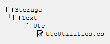
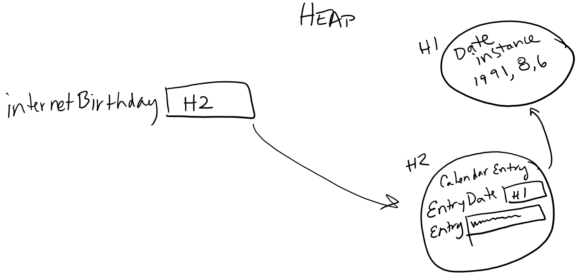
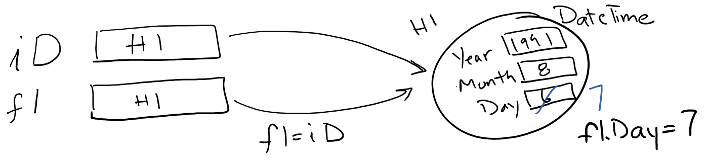

== C# Methods, Classes, and Objects

////
Programming languages allow us to automate tasks, and we do so because we want to do the same task repeatedly. We may find tasks that need to happen several times within our code, in different places. Grouping code into logical blocks that we can call from different places
////

So far, C# looks very similar to JavaScript and Java. 
It is object-oriented, so it supports reusability through classes with  methods and properties and polymorphism with inheritance, interfaces,and overloading. 
C# also introduces some unique and powerful features, such as delegates 
(type-safe function pointers) and lambda expressions (anonymous functions). 
There is a rich set of foundation classes provided in ASP.NET, the Foundation Class Library, providing collections, threads and locking, security, and much more.

Object oriented design requires defining a class and then giving it both class (static) properties and methods and object (instance) properties and methods. Instances of the class are called objects. Static properties and methods are shared by all of the instances -- if one changes it, they all see the change. In fact, anyone who can see the class can see them (more on this in a bit). Each instance of the class gets its own copy to manipulate of the instance properties and methods in the class.

So far we've been playing fast and loose with static versus instance methods and properties; it's time to clear that up:

* When we call a method or access a property by dotting off of a local variable or a property (remember, DateTime.Now is a property), then we are calling the instance method or property for the object instance that variable holds. If we change the property value, then it only changes it for that instance. 

* When we call a method or access a property by dotting off of a class name (DateTime and Math are class names), then we are calling the static method or property of the class -- there is only one copy of that property or method, and it's visible to us. If we change the property value, then everyone who accesses that property sees the change.  

DateTime.Now.Month accesses the Month property of the instance stored in the Now property of the DateTime class.  Math.Sqrt(9) accesses the static method Sqrt on the Math class.

How do we tell which ones are static versus instance?  As you will see as we introduce the language structures, the keyword ``static`` is used on static properties and methods, and no such keyword is used on instance properties and methods.

Let's look at methods first, then classes and their properties and methods.

=== Methods

So far we’ve only written short blocks of code in our web pages.
In this chapter, we’ll show you how to organize more complex code and make code reusable, using methods and classes.

A method is a collection of code with a name and some inputs; it may or may not produce an output, and it may also alter the state of the object and of any objects it has access to.  Because we can give it inputs, the method can change its action based on the values it is given. If the method returns a value, our program gets the value when the method completes.

Methods provide the behaviors for a class or an object; typically these are things the class or instance will want to do repeatedly. Rather than have a huge method for a complex action, we may also define smaller methods that are called by other methods. Each method should have one clear action that it performs.

Methods can be used over and over, at different places in the program. A
method can even be used inside another method. This allows you to write
simple methods and then use them to help write more complex methods,
which can then be used in turn in other methods. In this way, very complex
programs can be built up step-by-step, where each step in the construction is reasonably simple.

==== Adding methods to a page

Razor provides a way for us to put server-side code in a web page. There is a special Razor block for adding methods to the web page, @functions { .. }. This block has to contain pure C#, no embedded HTML is permitted; this keeps the Razor engine simpler, and Razor provides Helpers, a similar tool, to create re-usable code blocks that do contain embedded HTML.

Razor's @functions are methods. We've mentioned earlier that your page is an object; in fact, there is a class for it, and each user who accesses your page gets an instance of that class. The @functions that you define are methods in that class.

Here is a function block containing functions to compute a tip amount:

[source,java]
----
@functions {
    double ComputeTip(double subtotal, double tipRate) {
        double tip;
        
        tip = subtotal * tipRate;
        
        return tip;
    }
    
}
----

Notice that this is computing just the tip -- it is important to clearly document what your method is doing, so that those who use it can tell what it is doing. We see this with Math.Sin and the other trigonometric functions: they clarify that they work on radian values, not degrees. There are tools that will turn the comments on your methods into such documentation, so be sure to clearly document the assumptions your method makes and the computation it performs. Not everyone will have access to your source code.

Let's pull apart the function above:  ``double ComputeTip`` specifies that this method will return a value of type double, and that its name is ComputeTip.  If it did not return a value, its return type would be the non-type ``void``. Notice the keyword static did not appear -- that makes this an instance method. Instance methods are mainly needed if they change the object state, and you may be able to determine that this one does not change the object state: it computes a value based solely on its inputs. It could have been defined static.

Notice that the C# convention is that method names start with an initial uppercase letter and parameter names start with an initial lowercase letter.

Next we see ``(double subtotal, double tipRate)``. The parentheses tell the compiler "I am giving you the parameters now", and are needed even if your method has no parameters. Each parameter is specified with a type and a name. The name becomes a local variable that we can use inside the method. When the method is called, the argument value is computed and then copied into the parameter for use within the method. The parameter's value is _never_ copied back out to the caller, so any changes to it will not be seen by the caller.

A parameter's scope is the method it is defined within. Parameters behave like variables, so no variable within a method can have the same name as a parameter. 

Finally, we see ``{ .. }`` -- this looks like our Razor code block. It is the body of the method. It can only contain C#, Razor does not permit HTML lines within a method.

Within the code block, you may notice a statement you have not seen before: the return statement: ``return tip;``. The syntax for this statement is:

[source,java]
----
    return EXPRESSION;
----

When that statement is seen within a method, the EXPRESSION is evaluated and the method is exited, with the value of the expression returned to the caller. This happens no matter where the return is within the method; if it is within a for loop or a switch statement, execution of the method halts at that point, and the value is returned to the caller.

Void methods (those not returning values) can use a ``return;`` statement to return control to the caller, or will return control when the closing ``}`` is reached, if there was no explicit return statement.

You can include additional methods in the @functions { } block; and because of how Razor processes it, the functions can appear anywhere in the page and be called even before they appear. By convention, we will place them at the top, before they are used.

You can invoke the same method more than once, and you can have one method invoke another. A method can even invoke itself.

[source,java]
----

subTotal += ComputeTip(subTotal,chosenRate); <1>
total = subTotal + ComputeTax(subTotal,locationCode); <2>

----

<1> In the code above, you see that subTotal is passed to ComputeTip, and the result is added to subTotal and put back into the subTotal local variable.
<2> Next you see that the tax is computed using the new value of subTotal and a location code for looking up tax rates, and added to subTotal to compute the total amount. 

We see that two different methods are called and used in the code above. Notice that the methods are not executed when the @functions { } block is seen; rather, they are executed when the are called from other C# code. This is called the _flow of execution_. It's important to keep this in mind; if you never call a method, then it is never executed.

Beginners often wonder why it is worth the trouble to create new methods.
There are many reasons, here are a few of them:

*   Creating
 a new method gives you an opportunity to give a name to a group of
statements, which makes code easier to read and understand.

*   Introducing new methods can make a program smaller by eliminating repetitive code.
For example, we can compute the tip amount based on the value the user gave us without a separate computation for each specific amount.
*   A common problem solving technique is to break tasks down into sub-problems.
Methods allow you to focus on each sub-problem in isolation, and then compose them into a complete solution.

==== Parameters and Arguments

Some of the methods we have used require arguments, which are the values you provide when you invoke the method.
For example, to take a substring, you provide the starting and stopping locations with in the string value.

When you use a method, you provide the arguments.
When you write a method, you name the parameters.
The parameter list indicates what arguments are required.
The following code shows an example:

[source,java]
----
@functions {

    // Put the first letter at the end and add "ay"
    string PigLatin(string word) {
        return word.Substring(1,word.Length-1)+word[0]+"ay";
    }
}

// form to get a word from the user

@PigLatin("Hello") @PigLatin("There"), in Pig Latin your word is: @PigLatin(yourWord).

----

``PigLatin`` has a parameter named ``word`` with type ``string``. When we call ``PigLatin``, we have to provide an argument with type ``string``. This can be a variable, a string literal, another method call (for a method that also returns a string), or an expression which evaluates to a string. In our example, we've called it three times: twice with string literals, and once with a local variable.

Before the method executes, the argument gets assigned to the parameter.
In this example, the argument ``"Hello"`` gets assigned to the parameter ``word`` for the first call to PigLatin. In each subsequent call, the value of the argument is assigned to ``word`` in turn.

This process is called parameter passing because the value gets passed from outside the method to the inside.
An argument can be any kind of expression, so this works also:

[source,java]
----
@PigLatin(yourWord+"s");
----

Here the word you supplied has an s added to the end before that value is assigned to the parameter named ``word``. The value you provide as an argument must have the same type as the parameter. So if your word was "round", ``word`` get the value "rounds" assigned to it.

The value you supply has to be a string. For example, if you try:

[source,java]
----
 @PigLatin(17);  // syntax error
----

You will get an error message like this:

[source,text]
----
PigLatin.cshtml(25,10): error CS1502: The best overloaded method match for 'ASP._Page_PigLatin_cshtml.PigLatin(string)' has some invalid arguments
PigLatin.cshtml(25,19): error CS1503: Argument 1: cannot convert from 'int' to 'string'
----

The first error message is letting you know the compiler tried to find any method named PigLatin that will work (you can define two methods with the same name -- more on this in a bit). The second one is more useful: it's telling you your argument has the wrong type.

Sometimes C# can convert an argument from one type to another automatically.
For example, ``Math.Sqrt`` requires a ``double``, but if you invoke ``Math.Sqrt(25)``, the integer value ``25`` is automatically converted to the floating-point value ``25.0``.
But in the case of ``PigLatin``, C# can’t (or won’t) convert the integer ``17`` to a ``string``.

Parameters and other variables only exist inside their own methods.
Inside your page, there is no variable named ``word``.
If you try to use it there, you’ll get a compiler error.

Because variables and parameters only exist inside the methods where they are defined, they are often called local variables.

==== Named Parameters and Optional Arguments

You may have noticed an issue with our pig latin implementation: ``PigLatin("There")`` returns the value ``hereTay`` when it should return the value ``ereThay``, since "Th" is the first sound-unit in the word.

Usually only one letter is needed; so we could require a length, but that makes everything work harder. C# solves this by offering us default parameters. You can specify a default value for a parameter, and if it is not specified, its default value is used.

To make this work, C# also lets you specify a name next to an argument value, to say what parameter the value is for.  Let's rewrite our code and see how this works:

[source,java]
----
@functions {

    // Put the first letter at the end and add "ay"
    // if the length gives us nonsense, ignore it and return the word
    string PigLatin(string word, int numChars = 1) {
        if (numChars < 1 || numChars > (word.Length-1)) {
            return word; // just return the word on bad lengths
        }
        
        return word.Substring(numChars,word.Length-numChars)
               + word.Substring(0,numChars)
               + "ay";
    }
}

// form to get a word from the user

@PigLatin("Hello") @PigLatin("There",2), in Pig Latin your word is: @PigLatin(word: yourWord).

----

Because we have given a default value for numChars, if it is not specified then when the method executes it is given the value 1. We say that numChars is an optional argument.

Notice the final call: ``@PigLatin(word: yourWord)``. Here we use the parameter name and a colon to say what parameter the argument value is assigned to.  With named parameters, we don't have to match the order specified in the method. We could say: ``@PigLatin(numChars:2, word:"cheese")``. C# will match up the arguments to the named parameters, rather than using their positions.

If you do not specify parameter names on the method invocation, then positional matching is done. C# lets you use positional matching for the start of a method call, but once you use a named parameter, then you have to name the rest of your arguments as well. Any unnamed or unspecified parameters in the method call must have defaults, and those defaults will be used when the method is invoked.

[TIP]
====
Notice that I took care in writing the new version of PigLatin to deal with bad input values. I also stated how I handled them in the comments on the method. Consider what inputs can make your method mis-behave, and determine what behavior you want it to have. Here are some typical choices: 

1. just let it do whatever C# would have it do, whether that is to throw an exception or continue on with a corrupt value (sometimes this is the right thing to do, but it should still be made clear that it was a decision made in your design)

2. throw an explicit exception about the bad input values (this informs the caller about specifically what went wrong, and lets the caller decide how to handle it)

3. handle the situation so that the program continues with some known good state (this lets the program continue uninterrupted, but does mask the problem of the bad inputs)
====

C# has another type of variable parameter list, for details on that see https://msdn.microsoft.com/en-us/library/w5zay9db.aspx.

==== Parameters and Objects

C# uses pass by value for parameters: the argument value is copied into the parameter value, and no changes to the parameter's value are ever seen by the caller. _However_, if you go through a parameter to values it has access to (if it is an object or an array), then the changes you make through the parameter will be visible to the caller.

With arrays, this means that you can change the contents of the array, and the caller will see those changes.However, if your method changes the parameter's value, to point to a new array, that change will not be seen by the caller.

[CAUTION]
====
C# also provides two other parameter modes: pass by reference and pass as output.

"pass by reference" on parameters means that changes to them are seen; this is done by putting the keyword ``ref`` before the parameter type. When used, the keyword ``ref`` must be put before the argument as well, and it must be a storage location (something that can be on the left of an assignment statement). Any changes to the parameter's contents will be visible to the caller.

"pass as output" on parameters means that the values are not read in from the arguments, but are only assigned within the method and then visible upon return. ``out`` must be put both on the parameter declaration and the argument value. The argument will not be read or copied to the parameter when the method is called, but they will be updated with the value of the parameter when the method completes.

This isn't generally good practice in OO programming, but does give fine-grained control that is useful in procedural systems programming.
====

==== the call stack

When a method is called, it needs space for its parameters. The system notes where it was called from (the calling method's activation record). It creates an activation record with room for the  methods parameters, and puts that on the activation record stack, often just called the "call stack", as its primary contents are method invocations.

When the method completes, its activation record is removed from the stack; if it had a return value, that is supplied to the calling method for that method to use in the containing expression.

Let's step through an example with these methods:

[source,java]
----

int Times2(int val) {
  return val*2;
}

int Times10(int val) {
  return val * Times2(5);
}

int TImes20(int val) {
  return val * Times10(2);
}
----

When `Times20(4)` is called, an activation record is put on the top of the stack to hold the fact that Times20 is called, and its parameter val is given the value 4, from the argument value.

`Times20(4)` will call `Times10(2)`; this creates a new activation record which is put on top. `Times10(2)` will call `Times2(5)`. At this point the call stack looks like this:

|====
| top of stack

| Times2(5) val = 5
| Times10(2) val = 2
| Times20(4) val = 4
| ... calls below Times20(4)
| bottom of stack
|====

When `Times2(5)` completes, it is removed from the call stack and returns the value 10 to its caller (`Times10(2)`), who then uses it to compute val * 10, using its own value of val, i.e. 2. That then removes itself from the call stack, returning its value, 20, to `Times20(4)`. That then removes itself from the call stack, using the returned 20 and its value of val, 4, to compute 80; it then removes itself from the call stack and returns 80 to its caller. 

It's important to be able to draw call stacks and trace the values in variables -- a key style of debugging is the "code walkthrough" where you are the computer, checking that the code is doing what you expect with a manual walkthrough yourself rather than running the code.

==== method syntax

A method is defined in a class; since our Razor pages are turned into classes, it provides us with the @functions { .. } block to permit us to do this. We can also put methods in classes, as we will see in the next section.

A method definition in C# takes the form:

[source,java]
----
modifiers  return-type  method-name  ( parameter-list ) {
    statements
}
----

The statements between the braces, { and }, in a method definition
make up the body of the method. These
statements are the
instructions that the computer executes when the method is called. Methods
can contain any of the statements discussed previously.

The modifiers that can occur at the
beginning of a method definition are words that set certain characteristics
of the method, such as whether it is static or not. 
Another modifier that can be specified is the visibility of the method, one of these:

public:: the method can be called from anywhere.

private:: the method is only visible within the class, so it can only be called from other methods in the same class.

protected:: the method is only visible to its class, or from a subclass of this class.

internal:: the method is only visible from within the same project. This limits callers to just your library, if you were building a library and wanted some internal utility methods.

protected internal:: the method is visible from this class, any subclasses (even if in another project), and any other class in the same project.

If you do not specify a visibility for your method, then its visibility is *private* . Since you do not explicitly access the page class for your Razor page, and won't need to access the methods outside of the page, this is appropriate.

For the full list of modifiers, some of which are beyond the scope of this text, see https://msdn.microsoft.com/en-us/library/ms173121.aspx.

If the method computes a value, then
the return-type is used to specify the type of
value that is returned by the function.  It can be a type name such as
string, an array type
such as double[], or a Class - any valid C# type. If the
method does not return a value, then the return-type is replaced 
by the special value void,
which indicates that no value is returned. The term "void" is meant to indicate that the return value is empty or non-existent.

Finally, we come to the parameter-list of
the method. Parameters 
represent information that is passed into the method from outside, to be
used by the method's internal computations. 
The parameter list in a subroutine can be empty, or it can consist of one or
more parameter declarations of the form ``parameter-modifier type parameter-name optional-default-value``. If there are several
declarations, they are separated by commas. Note that each declaration can name
only one parameter. For example, if you want two parameters of type
double, you have to say "double x, double y", rather than
"double x, y".

parameter-modifier:: is optional and specifies either pass by value (no modifier), pass by reference (ref), or pass as output (out). ref and out have to be used as prefixes to argument values as well.

type:: any valid C# type can be used as a parameter type.

optional-default-value:: is specified as ``= constant-value``, providing a default value if no argument value is provided for this parameter. The constant value can be a literal or a constant expression (something the compiler can evaluate).

[TIP]
====
You may also see methods with abbreviated bodies such as this:

``public string Name +=>+ First + " " + Last;``

Here, the method Name has no parameters, and returns the value computed using the properties First and Last from the containing class.

These are Expression Body Definitions, and you can read more about them here: https://msdn.microsoft.com/en-us/library/ms173114.aspx
====

==== Helpers

Razor has a feature not found in C# classes, the helper. This is a type of function that embeds HTML within it, the same way we have already done in our Razor code blocks. You define one helper at a time, like so:  

[source,java]
----
@helper HelperName (parameters) {
  .. helper body ..
}
----

Then you can invoke the helper with @HelperName(arguments) later in your Razor page.  The helper body can contain the same code as any other Razor block, that is, it can contain both C# and HTML.

When you invoke the helper, it is replaced with the HTML that its helper body generates. You do not use a return statement in a helper.

For example:

[source,HTML]
----
@helper OperatorList() {
      <option value="add">+</option>  
      <option value="sub">-</option>  
      <option value="mul">*</option>  
      <option value="div">/</option>  
      <option value="mod">%</option>  
}

<form ...>

...
<select name="op1">@OperatorList</select>
...
<select name="op2">@OperatorList</select>
...

</form>
----

Here you can see we have a helper that will put the same list of operators wherever it is used. This helps us keep our page correct -- if we need to change the list, we only change it once, and that is seen everywhere the list is used.

=== Classes

Classes are what make object orientation so rich; they provide many, many capabilities. We've already seen methods, but there are properties also, and many aspects of classes to fulfill the OO features of inheritance, encapsulation, and overloading.

You will define each class in its own file with the file extension .cs. To make your source code deployable, put these files in the App_Code directory of your project. ASP.NET looks to that directory to compile code.

What code goes in a class, versus in Razor functions? Object-oriented design says that you design a class when you want to have the ability to use the functionality from different pages in your web site. So if you have common functionality that several of your pages use, you would define a class for it, and then use the class's methods and properties to access the functionality. 

====
Remember to be DRY : if you find yourself repeating code, then methods and classes are called for.
====

==== Classes live in Namespaces

Namespaces give you a way to group classes into logical groups. You place a class within a namespace when you define the class, like so:

[source,java]
----
namespace Storage {

  // class definitions here
  
}
----

Typically you put one class in a file; this means you put the namespace clause around it in that file. You use the same namespace clause in each of your files containing classes in that namespace.

If you do not use a namespace clause, your class is put into the default, unnamed, namespace. Although this is not good practice, you will often see this done in learn-to-program situations. A general convention is to put your code in a namespace that matches your project name, and then to further organize it into multi-level namespaces to separate your code into logical groups.

The namespace name can have multiple parts separated by dots, i.e. Storage.Binary, Storage.Text, and Storage.Text.Utc are all valid namespace names.

By convention, you build a directory structure that matches your namespace names; where namespaces use . to separate the name, you make another level of directories. Your classes go in the lowest directory. So, if the namespace Storage.Text.Utc had a class UtcUtilities, you would see this directory structure:

.Namespace Directory Hierarchy

////
[tree,file="images/NamespaceSample.png",height="+200",width="+100"]
--
Storage
`--Text
   `--Utc
      `--UtcUtilities.cs
--
////

[TIP]
====
Namespaces, like classes and methods, start with an Uppercase letter. This is a coding convention, not a requirement.

Notice another convention here: CamelCase even applies to acronynms like UTC -- in a C# name, we write it as Utc.  Similarly, HTML becomes Html when used in a C# name. This convention may seem grating, but if you want your code to appear professional, it's best to follow the convention.
====

You can decide if the class ought to be visible outside of its assembly by setting an access modifier on it; these are similar to the ones for methods:

* public : visible outside of its assembly
* internal : only visible within its assembly (the default)

internal, the default, is sufficient for our needs.

[TIP]
====
What's an assembly? it's whatever code was assembled for your application. We aren't building cross-assembly projects here, but we do use ASP.NET: everything from that that we use had to have been declared public.
====

Once you have classes within namespaces, you can then decide how to access them outside of their namespaces. In order to access a class from another Namespace without qualifying it by its namespace name, you add a using statement to the top of your .cs file, before the namespace clause:

[source,java]
----
using System.Collections;
using System.Web.WebMail;

namespace Storage {

  // class definitions here
  
}
----

The using statement lets you reference classes within that namespace without qualifing them. It does not let you reference nested namespaces -- you have to explicitly add a using statement for each nested namespace to use its classes without qualification.

You can put any number of using statements at the top of your file, or even within the namespace clause. If they define classes that have the same names, references to those names are considered ambiguous; C# has ways to resolve this, the simplest is to fully qualify those names. If your using namespace contains a class by the same name as your class, the class you are defining is the one used. 

For other ways to resolve ambiguous class names, see https://msdn.microsoft.com/en-us/library/aa664766(v=vs.71).aspx

==== Classes define Methods

We've already stepped through method definitions; methods are placed within a class, and can operate either as static methods, called by dotting off of the class name, or as instance methods, called by dotting off of a variable or property referencing an object of the class type.

[source,java]
----
namespace Utilities {

  /// methods to manipulate strings
  public class StringUtilities {
  
      /// returns the word turned into pig latin
      /// assumes the word is a word (not more than one word)
      public static string PigLatin(string word) {
          ...
      }
  }
  
}
----

Here we have put our PigLatin method in a class called StringUtilities, in a namespace called Utilities. So we can invoke the method like so:

[source,java]
----
    string result = Utilities.StringUtilities.PigLatin("hello");
----

Because it is a static method, we dot off of the class name.

==== How do Classes create Objects?

How would we call an instance method?  First, we need to be able to create instances of the class.  We saw an early example of this with Random, where we created a new Random object by saying ``new Random()``. This was actually using something in the class: the constructor.

A constructor is a special code block (you may hear it called a "special method", as it looks like a method) defined in the class to say what steps to take when a new instance is created.  For instance, you may want to initialize the instance's properties or you may want to require certain information be provided when instances are created.

You define a constructor in the same manner as a method except that it has no return type, and the name is the same as the class name. It also has no return statement -- it can only be used within a ``new`` statement, to create an instance of the class.

[source,java]
----
public class Car
{
    string model;
    
    public Car()
    {
        model = "Ford";
    }
}
----

[NOTE]
====
Yes, I did sneak a variable definition into the class; they are allowed in class bodies, too; more on this in a bit.
====

If you do not define a constructor, then a class implicitly has one that takes no arguments, and initializes any class variables to their default values (0, false, or null).

If you define a constructor that takes parameters, then there is no longer a default constructor.  You can define as many constructors for a class as you like; they must all take different parameter types or a different number of parameters.

[source,java]
----
public class Car
{
    string model;
    
    public Car()
    {
        Car("Ford"); // "call" the other constructor; you can only call
                     // constructors from other constructors.
                     // It's good practice to call the more specific
                     // constructor, supplying defaults.
                     // This avoids duplicating code between constructors.
    }
    
    public Car(string m)
    {
        model = m;
    }
}
----

If you do not want instances of the class created, then you can define a 0-arg constructor that is private; this hides the construtor from any other class. We might do this in our StringUtilities class to prevent anyone from creating instances, since it only defines static methods:

[source,java]
----
public class StringUtilities
{
    private StringUtilities() { } // no instances can be created
    
    ... static methods here
}
----

In order to create an instance of a class (an object), you have to know what constructor(s) it has. You create the instance with a new operator, passing the values the constructor requires. 

[source,java]
----

  Car myCar = new Car();
  Car myDaughtersCar = new Car("Volkswagon");
  
----

The ``new`` operator takes a class name and constructor arguments and returns a new object that has been created and initialized by the constructor.  That new object can be:

. stored in a variable (as our example)
. stored in an array of that object's class
. stored in a Property of that object's class

[source,java]
----
  DateTime[] importantDates = {
    new DateTime(1944,1,1), // first computer
    new DateTime(1991,8,6) // first web server
  };
----

Here we initialize an array with two objects.

[TIP]
====
That's handy, but what about the class -- perhaps we want to initialize the static properties. You can define a static initializer in a class like so:

[source,java]
----
class CalendarEvent {

    static DateTime calendarStarted;
    
    static {
        calendarStarted = DateTime.Now;
    }
}
----

In this code, we have a private variable in the class and we initialize it to the current system time when the class is loaded. It captures the time the calendar was started in our application.
====

==== Objects: where are they?

Objects are pretty complex entities. As such, it's important to understand that what is in the variable, array entry, or property is not the mass of the object but is an object reference. Objects are located in a separate part of your computer's memory usually called the heap. The address of your object is what is stored in the variable, array entry, or property. We call this an object reference.

So, if two variables are assigned the same object, then changes to the object in one variable are seen by the other variable. But we need properties to show this more clearly, so let's return to this in a bit.

==== Classes define Variables and Properties

Classes get their power from having not only methods, to implement common behaviors, but also by having properties, to store state.

Properties can be at the class level: static; or they can be at the object level: instance.

C# does a very nice job of separating the idea of a property from another idea, that of a variable.

Properties are the visible state of the object. 

===== Class local variables (aka fields)

I hinted above that you can have variables defined directly in your class. Static variables are defined for the class (so all instances share them) and instance variables are defined for instances (so each instance has its own instance of the local variable, the other instances get their own).

These are defined just like those in code blocks:

[source,java]
----
class Car
{
    string model;
    int odometer;
    int gallons; 

    ... rest of class here    
}
----

Here we see we define three variables in the class; these are not defined static, so when an object is created, it gets its own three variables local to it. All of its methods can see these variables; they are primarily used as a way to track the object's properties.

You could make these variables available outside of the class by giving them an access modifier. Variables use the same access modifiers as methods, and their default is also private.

[TIP]
====
It is not good practice to give outside access to class variables; proeprties should be used instead.  For this reason, by convention a class's variables are initial lower case like other local variables and are private.
====

===== Properties

Properties define state. Static properties define the class state (like Now on DateTime) and instance properties define the object state (like Month on DateTime).

Poperties are defined like this:

[source,java]
----
class Car
{
    string model;
    int odometer;
    int gallons; 

    public int Model {
        get { return model; }
        set { model = value; }
    }
    
    public double MilesPerGallon {
        get { return odometer/(double)gallons; }
    }
    
    ... rest of the class    
}
----

Properties define their visibility, type, and name, and then provide their get and set operations. The ``get`` operation is used whenever you access the property in an expression, and the ``set`` operation is used whenever you have the property as the target of an assignment statement.

As you can see in our example, Model is very simple: it simply reads from the instance variable model, and writes to it (``value`` is a keyword in C#, meaning the value of the right side of the assignment statement). However, MilesPerGallon only has a ``get`` operation, and that is computed from two of the instance variables. This means that MilesPerGallon cannot be the target of an assignment statement.

You can put access modifiers on the get and set code blocks; this is useful if you want those who use your class to get it, but only make it settable within the class. You will see this in StatClass.cs in the exercises.

Since the style of property that directly reads and writes it underlying variable is so common, C# defines a shorthand to do both at the same time:

[source,java]
----
class Car {
    int odometer;
    int gallons; 

    public int Model { get; set; }

    public double MilesPerGallon {
        get { return odometer/(double)gallons; }
    }
    
    ... rest of the class    
}
----

Notice that we don't have to define the variable separately.

[CAUTION]
====
This clear definition of properties is a very clever feature of C#. You often want to "gate" property access with security levels, and ensure that assignments only get valid values. By using code blocks, you can make sure your properties are correctly accessed and updated.
====

Properties, like methods and variables, can have access modifiers. They, like other class contents, are private by default. When you want a property to be visible state of the class (static) or object (instance), you need to make it public.

For more on C# Properties see https://msdn.microsoft.com/en-us/library/x9fsa0sw.aspx[Properties (C# Programming Guide)].

=== Objects

Now that we have classes, how do we use them?

Let's define one for our examples with objects:

[source,java]
----
class CalendarEntry {

    static const Date OldestYearPermitted = new Date(1900,0,0);
    
    DateTime date;

    public CalendarEntry(Date d, string e) {
        EventDate = d;
        Event = e;
    }
    
    public string Event { get; set; }
    
    public DateTime EventDate {
    
        get {
            return date;
        }
        
        set {
            // Check boundaries for dates.
            if (value.Year > 1900 && value.Year <= DateTime.Today.Year) {
                date = value;
            } else {
                throw new ArgumentOutOfRangeException();
            }
        }
    }
}
----

[NOTE]
====
Notice the order of defintions in CalendarEntry. Any order is allowed, but by convention we put them in this order:

* constants (variables defined static const cannot change value and are available to the class and all instances).
* static variables
* instance variables
* constructors
* public methods (static and then instance)
* private methods (static and then instance)
* destructors
====

==== The new expression creates instances

When we want to create a CalendarEntry instance, we use a `new` expression. Because it has defined a constructor, there is no default constructor; this forces us to provide values for the object's properties.

[source,java]
----
 CalendarEntry internetBirthday = 
       new CalendarEntry(
           new DateTime(1991,8,6),"internet's birthday");
----

Notice that we had to create a `DateTime` object to put in the `EventDate` property, used when we create the `CalendarEntry` instance, which is then put into the local variable `internetBirthday`.

This is what that looks like conceptually.

We have two objects on the heap, and the local variable within its scope (which may be a method or a class).

There is a shorthand way to create and initialize an object when its class has only a default or no-argument constructor:

[source,java]
----
    new DateTime{ Year = 1901, Month = 6, Day = 30 }
----

This creates a new instance and then updates its properties to the supplied values. The example here shows DateTime with three of its properties being initialized. Any uninitialized properties are set to default values (0, false, or null).

==== The null value

Now, you might not always have an object; what do you do then? C# provides a special value, ``null``. This can be assigned to any variable or property that holds an object. If you recall, arrays are actually objects -- so any variable that holds an array can also be set to null.

[TIP]
====
You can turn any primitive type to one that can also hold a null; do this by delaring the variable with a ? after the type. This does require more storage space for the variable.
====

[TIP]
====
The ?? operator is a shorthand way to check nullability: ``x ?? y`` has the result y if x is null, and x if it is not null.
====

Because variables can hold this value, if you try to look at a property or invoke a method on an object when there is no object (the value is null), you will get a *NullReferenceException*. Usually this is a defect in your code -- you should always check for nulls and then determine appropriate handling, whether it is raising an exception or taking a substitute action.

==== `this`

Notice that we have accessed the instance variables, methods, and properties directly by name within the class, while outside the class you have to dot off of a local variable to access them. There is an implicit local variable always available within the methods of your class, named `this`. `this` refers to the current object that the method or property is being invoked upon. Within the class definition, if the reference is not ambiguous, `this` is optional.

For CalendarEntry, I could have written the constructor like this:
[source,java]
----
    public CalendarEntry(Date d, string e) {
        this.EventDate = d;
        this.Event = e;
    }
----
The optional `this.` has been put in front of each of the properties having values assigned. When the properties' set code blocks are executed, they are executed against the current object, `this`.

==== Objects as parameters

Notice that variables hold references to objects. When you change a property in that object, it makes the change on the heap.

That means if two different variables hold references to the same object, each will see changes the other made.

[source,java]
----
    DateTime internetBirthdate = new DateTime(1990,8,6);
    DateTime firstWebPageServed = internetBirthday; <1>
    firstWebPageServed.Day = 7;
----

<1> Notice that the object reference is copied from `internetBirthdate` to `firstWebPageServed`. So both refer to the same object on the heap. When the Day property of one is changed, it changes it on the heap: so the change is immediately visible to the other variable as well.

.Two Variables Reference the same Object

That also means if a variable passes its value to a parameter, and the method makes changes to the object through the parameter, they will be visible to the variable after the call completes.

The only way to have that not happen is to ensure the variables point to different objects on the heap, using a separate `new` for each one. Even if they have the same property values, there will be two distinct instances on the heap.

==== But wait, won't memory fill up?

It would, yes, if all we did was`new` all day. However, the system is watching everything we do (in this case, the system is the ASP.NET CLR engine that is running our compiled code). In particular, it keaps track of whether we have a variable or property referencing an object or not. Once no variable or property references an object, it can be thrown out,  and its memory made available back to the heap. This is called "garbage collection".

==== Boxing and Unboxing
I already mentioned the nullable attribute for the primitive types; but that is not always sufficient; sometimes, you have to have an Object rather than a primitive type.

In fact, each of the C# primitives maps to a specific ASP.NET Class, as shown in the following table.

.C# type and .NET class
|====
| C# Type | .NET Framework Type

| bool | **System.Boolean**
| byte | **System.Byte**
| sbyte | **System.SByte**
| char | **System.Char**
| decimal | **System.Decimal**
| double | **System.Double**
| float | **System.Single**
| int | **System.Int32**
| uint | **System.UInt32**
| long | **System.Int64**
| ulong | **System.UInt64**
| object | **System.Object**
| short | **System.Int16**
| ushort | **System.UInt16**
| string | **System.String**
|====

This means if you declare a parameter with the .NET type, and use a variable or expression that results in the C# type, that value will be *boxed* within an object of the .NET type. Similarly, if you use of the thes .NET types in an expression where the C# type is needed, it will be automatically *unboxed* and its value used; note that a `null` value in this situation will be handled according to how the variable was defined: if it's nullable, it takes the null. Otherwise, it raises a *NullReferenceException`.

[source,java]
----
  int currentDay = 26;
  Int32 tomorrow = currentDay + 1; <1>
  
  ... time passes
  
  currentDay = tomorrow; <2>
  tomorrow = currentDay + 1; <1>
----

<1> `currentDay` is an int, so it can be added to 1 and will result in an int. The target of the assignment statement is a `Int32` so that result will have to be boxed; it would be the same as saying: ``Int 32 tomorrow = new Int32(currentDay + 1);`` We don't have to explicitly use the new, as our int value result will be wrapped in an Int32 to automatically box the primitive with object-ness. (We could call this boxing's object-ive. Couldn't resist.)

<2> When we want to assign an Int32 to an int, the reverse has to happen. The int value within the Int32 is unboxed, and its value is copied into the variable. Because this behavior is specific to each particular target type, there is no single method that is called to do it.

You may have noticed the type object in our list above; objects can hold any item at all; if they are assigned a primitive from a local variable, they will box it. To unbox from an object, you have to first typecast it down to the appropriate primitive type.
[source,java]
----
  int currentDay = 26; 
  object objectDay = currentDay; // boxed, put in the heap
  
  currentDay = (int)objectDay; // to get it back out
----
//TODO: pictures!

Similarly, you can put any object instance in an object. But to see it as its original class, you will have to typecast it back to that class. As an object, the methods specific to your class are not accessible.

[source,java]
----
  DateTime internetBirthday = new DateTime(1991,8,6); 
  object something = internetBirthday; // copies the object reference,
                                       // but loses its DateTime-ness
  
  internetBirthday = (DateTime)something; // transform it back
----

[NOTE]
====
Boxing and Unboxing have a huge impact on performance, so it is best to be aware of when you have the C# type and when you have the .NET class. In general, stick with the C# types unless there's no way to avoid using the .NET types.
====

=== Inheritance

The object built-in type hints at a key object-orientation feature: inheritance.

Class definitions are a good start at smart programming, as they modularize our code into understandable units with state and behavior.

We get an even stronger amount of re-use when one class can be a subclass of another class: that is, it inherits all of the fields, properties, and methods and then adds more.

Often you need classes that differ only a little bit; either one can be the supertype of the other, or they have a common supertype and they are both its subclasses.

The keyword `extends` is used to note that a class has a superclass, like so:

[source,java]
----
class CalendarRepeatingEntry extends CalendarEntry {
    Public int NumRepeats { get; set; }
    
    ... more added to class
}
----

All of the public methods, properties and variables in CalendarEntry are now available to CalendarRepeatingEntry and its instances. So it not only has NumRepeats but also has EventDate and Event.

If you do not specify `extends`, then your class automatically extends System.Object.

The method, property, and variable access modifiers may make more sense at this point, now that you have seen inheritance:

public:: the method can be called from anywhere.

private:: the method is only visible within the class, so it can only be called from other methods in the same class.

protected:: the method is only visible to its class, or from a *subclass* of this class.

internal:: the method is only visible from within the same project. This limits callers to just your library, if you were building a library and wanted some internal utility methods.

protected internal:: the method is visible from this class, any *subclasses* (even if in another project), and any other class in the same project.

If you do not specify a visibility for a method, property, or variable then its visibility is *private* . If you do not specify a visibliity for a class, then its visibility is *internal*.

==== Impact on types

We can assign any instance to an object variable because object is the superclass of all other classes. In fact, for any variable defined to hold a particular class, we can assign not only instances of that class but also instances of its subclasses.  Basically, an object instance is an instance of its immediate class and also an instance of its superclasses. Each class has one single immediate superclass, except object (and System.Object, the same class), which has no superclass.

Let's walk through an example:

[source,java]
----
 CalendarEntry internetBirthday;
           
 RepeatingCalendarEntry internetParty =
       new RepeatingCalendarEntry {
           EntryDate = newDateTime(1991,8,6),
           Entry = "Internet's Party",
           NumRepeats = 100 };
           
 internetBirthday = internetParty; // OK
 internetParty.NumRepeats = 101; // OK
 internetBirthday.NumRepeats = 102; // ERROR
 
 internetParty = internetBirthday; // ERROR
 internetParty = (RepeatingCalendarEntry) internetBirthday; // OK but...

 CalendarEvent tcpBirthday = new CalendarEvent(
       newDateTime(1983,1,1),"TCP's Ratification Date");
       
 RepeatingCalendarEntry tcpParty;
 
 tcpParty = tcpBirthday; // ERROR
----

When we assign `internetParty` to `internetBirthday`, this works. Any access of the object through that variable (`internetBirthday`) will assume it is a CalendarEntry, and not a `RepeatingCalendarEntry`. This means that we can't access NumRepeats through `internetBirthday`, since it is hidden by the implicit cast to be just CalendarEvent.

The other direction is worse: when we try to assign a CalendarEvent instance to a RepeatingCalendarEvent variable, we can't do it at all. Why not? because there is no NumRepeats property in our CalendarEvent instance.

If we know we have a RepeatingCalendarEvent in our CalendarEvent variable, we can typecast it back to a RepeatingCalendarEvent.  Now, our "know" may actually be riddled with bugs, and a CalendarEvent object may have snuck into our variable; the execution engine does a final type check at runtime, and if the type cannot be cast because it is not actually a RepeatingCalendarEvent, then a *InvalidCastException* is thrown.

=== Overloading and Overriding

You may have noticed, if you have been looking at MSDN ASP.NET class specifications, that they often have methods with the same name but different parameter lists (a different number of parameters, or a different type parameter at a particular position in the list). This is called overloading a method with multiple implementations. When you call a method, method resolution occurs based on the arguments specified; their types have to match the types declared for one of the overloaded methods. That will be the method called.

For example:

[source,java]
----
namespace System;

class StringUtilities {

    static public char FirstLetter (long i) {
     .... determines the first letter of a short, int, or long
     return i.ToString()[0];
    }
    
    ststic public char FirstLetter (string s) {
     return s[0];
    }
}
----

Our class defines two FirstLetter methods, one that operates on longs (and thus, due to automatic conversion, will also work on ints and shorts -- this type of widening of parameters is a common design choice) and one that operates on strings.

When used, the type of the argument is used to determine which method to call:

[source,java]
----
    char firstOfOne = StringUtilities.FirstLetter(1); // returns '1' 
    char firstOfOne = StringUtilities.FirstLetter("hello"); // returns 'h'
----

The first call resolves to FirstLetter(long i) while the second call resolves to FirstLetter(string s). Notice that both return the same type -- that is required in overloaded methods.

You saw overloading at work in our constructor; you can define more than one constructor as long as the type or number of parameters differs.

For more on overloading, including how it is resolved with named parameters, see https://msdn.microsoft.com/en-us/library/ms229029(v=vs.110).aspx[Member Overloading] in the .NET Development Guide.

Overriding, on the other hand, is about defining the same method with the same signature in a superclass and a subclass. We say the subclass's method *overrides* the superclass's method.

You must design a method to deliberately allow itself to be overridden:

1. declare it to be a `virtual` method, with a method body; then its body is used unless it is later overridden; or
2. declare it to be an `abstract` method, without a method body, just a signature, and a ; where the body would have been; or
3. declare it to be an `override` method, providing a method body; such a method must be overriding a method in its parent using these three rules (note this requires some overall superclass to initially define the method virtual or static).

`abstract` and `virtual` methods cannot be static; only one is used, and it typically goes before the access modifier for the method (public, protected, etc.).

The overriding method must declare itself to `override` in the same manner that the base method delared itself override-able. It must also have the same access modifier, return type and parameter types as the overridden method.

Properties can also be overridden, using the same rules on the overriding modifier on the property (`static`, `virtual`, `abstract`, or `override`).

To access the superclass's overridden method or property within the overriding class, use 'super.' before the method or property name. This resolves to the method in the superclass rather than the local one, and is done so that your class can extend the definition found in the subclass, adding to it rather than completely replacing it.

For more information about how to use the **override** keyword, see https://msdn.microsoft.com/en-us/library/6fawty39.aspx[Versioning with the Override and New Keywords (C# Programming Guide)] and https://msdn.microsoft.com/en-us/library/ms173153.aspx[Knowing when to use Override and New Keywords].

The root class in C# is System.Object. System.Object defines two methods, `Equals` and `ToString` that is expects all classes under it to redefine. When you do so, you will be overriding these methods. `Equals` returns a boolean saying whether this instance is equal to the one passed to it; and `ToString` returns a string representation of the object.  `System.Object.Equals` bases equals on object identity; it's up to you to use that, or to replace it with one based on object state, which is commonly done.  `ToString` returns a representation as a string of the object's type and value.

We might define these on CalendarEntry like so:

[source,java]
----
  class CalendarEntry {
    ... other contents
    
    public override bool Equals(Object obj) {
      CalendarEntry calObj = obj as CalendarEntry; 
      if (calObj == null)
         return false;
      else
         // base it on the date and string values...
         // not perfect, what about nulls?
         return EntryDate.Equals(calObj.EntryDate) 
                 && Entry.Equals(calObj.Entry);
    }
   
    public override string ToString() {
      return EntryDate+": "+Entry;
    }
  }
----

Notice that I want to ensure value equality; I am using the .Equals methods on DateTime and String, which check value equality. If i read the API, I can determine if they have overridden the == operator to use value equality (have they? Check their specification pages on http://msdn.microsoft.com/

=== Interfaces

Inheritance is very powerful, and complex. So C#, like Java before it, restricts programmers to 1 immediate parent; we call this "single inheritance". There are designs so complex that single inheritance is not sufficient. However, implementing multiple inheritance is very complex.

C# took the same route as Java in this regard, adding interfaces and allowing a class to implement several different interfaces.  An interface can be thought of as a class without any implementation, for example:

[source,java]
----
interface IListableCalendarItem {

    ... methods and properties without code bodies

}
----

We can use more than one interface when we define a class:

[source,java]
----
class CalendarEntry implements IListableCalendarItem, IIterable {

    ...

}
----

The keyword `implements` on the class definition specifies which interfaces the class implements.

[NOTE]
====
The C# naming convention is to start all interfaces with the letter I and then an initial uppercase letter of the first word in its name. I've followed that convention in my example, and we will see it throughout ASP.NET.
====

If the class does not implement all of the methods and properties in the interface, then it is considered an abstract class, and it must have subclasses that complete the implementation. You cannot use a new expression on an abstract class. You can also explicitly make a class abstract by putting `abstract` before the keyword `class` in its definition.

We won't be defining interfaces ourselves in this text, but there are many useful interfaces in ASP.NET. We will see these in the chapter on Collections and Databases.

=== The ASP.NET and .NET Libraries

There are so many classes in ASP.NET that reviewing them all takes time; most developers get familiar with the ones they use regularly, and know how to look up the ones they don't use as often.

It's a good idea to always look around a little bit, as the ASP.NET libraries are large, and it's very possible the code you want, or some portion of it, is available to you in ASP.NET already. Why use the library? That code has been field-tested in diverse applications and environments, and stood the test of time. Are you going to test your code as thoroughly? 

You can find the core classes in the https://msdn.microsoft.com/en-US/library/mt472912(v=vs.110).aspx[.NET Framework Class Library].

The framework comes with .NET, which is underneath ASP.NET.

Here are a few classes it's useful to be familiar with:

----
System.Math - useful functions for numbers
System.String - many utilities for string manipulation
System.Convert - static functions to convert among the base types
System.DateTime - a date/time representation
System.Random - a random number generating class
----

`System.Text` is a useful namespace to explore if you are manipulating strings; it contains the class `System.Text.StringBuilder`, which is more efficient and building strings than `System.String`. 

System contains the core classes, but as we expand our look into databases, we will also be looking at the namespaces
`System.Collections` and `System.Data`.

The Framework Class Library comes in .NET, which is underneath ASP.NET. ASP.NET adds the System.Web namespace and all of its sub namespaces, which provide web functionality to your application.

=== There's more ...

We can only go so deep with C# classes in a first C# course. There are many more complex features to the C# class system including:

* partial classes
* abstract classes
* asynchronous methods
* delegates
* destructors
* nested types
* structs and enums
* anonymous types
* generic types
* class attributes
* https://msdn.microsoft.com/en-us/library/8edha89s.aspx[overloading operators]

The Microsoft Developer Network https://msdn.microsoft.com/en-us/library/67ef8sbd.aspx[C# Programming Guide] provides an overview of these features.

=== Further Reading

- http://dotnetslackers.com/articles/aspnet/Razor-Functions-and-Helpers.aspx#s2-overview-of-functions

- http://weblogs.asp.net/scottgu/asp-net-mvc-3-and-the-helper-syntax-within-razor

- https://msdn.microsoft.com/en-us/library/x9afc042.aspx C# Programming Guide on Classes

- https://en.wikibooks.org/wiki/C_Sharp_Programming

- https://msdn.microsoft.com/en-us/library/ms173114.aspx

- https://msdn.microsoft.com/en-us/library/t990ks23(v=vs.140).aspx APP_CODE

- https://prezi.com/0qr6eqniejad/the-10-most-important-events-in-computer-history/

=== Exercises

. Rewrite your GPS coordinate code from Chapter 3 to be two functions in a @function block. One returns the radians given the degrees, and the second returns the distance between two points in feet.

. Remember the dice calculations in previous exercises? Build a PairOfDice class that simulates having two dice; it will have a Roll method with a void return type that generates two new random, valid dice values, and methods ValueDie1 and ValueDie2 that return the individual values on the dice, and Total that returns the sum of the two die.
This can be impelemented to require an object or as static methods and properties (explain your choice in comments on the PairOfDice class). It should have both of its dice values be stored in private variables (or an array of 2).
+
`Roll` simulates olling a pair of dice. You can simulate rolling one die by choosing
one of the integers 1, 2, 3, 4, 5, or 6 at random. The number you pick
represents the number on the die after it is rolled. The expression 
`rand.Next(6)+1`
does the computation to select a random integer between 1 and 6, where `rand` is a variable holding a `Random` object.
+
Do not store the total, but compute it when it is requested from the two dice values. OO design is always a tradeoff: if you stored the total, you would recalculate it whenever there was a new roll, even if it was not requested, while if you don't, then you have to compute it each time it is requested. Your design would consider which of these was more likely, and program for that. Since we only request the total once for each roll, not storing it makes sense -- we won't be slower, and our object will require less storage in memory.
+
With that class, rework your page from Chapter 5. Make a page that reports how many times it has
to roll a pair of dice before they come up snake eyes. This is a simulation using your PairOfDice Class and using its Roll method to roll its dice.
+
The page should report the number of rolls that it makes
before the dice come up snake eyes. (Note: "Snake eyes" means that both dice
show a value of 1.) 

. A common programming task
is computing statistics of a set of numbers. (A statistic is a number that
summarizes some property of a set of data.) Common statistics include the mean
(also known as the average) and the standard deviation (which tells how spread
out the data are from the mean). I have provided a class called
StatCalc that can be used to compute these statistics, as well as the
sum of the items in the dataset and the number of items in the dataset. 
+
.StatCalc.cs
----
include::source/App_Code/StatCalc.cs[]
----
+
Notice the 
 tag and the use of three /'s -- this is C#'s way of providing documentation in published classes. If you are interested to find out more, see https://msdn.microsoft.com/en-us/library/b2s063f7.aspx[XML Documentation Comments] on MSDN.
+
If calc is a variable of
type StatCalc, then the following instance methods and properties are available:
+
*   calc.Enter(item)  where
item is a number, adds the item to the dataset.
*   calc.Count  is a property
that returns the number of items that have been added to the dataset.
*   calc.Sum  is a property
that returns the sum of all the items that have been added to the dataset.
*   calc.Mean  is a property
that returns the average of all the items.
*   calc.StandardDeviation  is
a property that returns the standard deviation of the items.
+
Typically, all the data are added one after the other by calling the
Enter() method over and over, as the data become available. After all
the data have been entered, any of the other methods and properties can be called to get
statistical information about the data. The properties  Mean and
StandardDeviation should only be called if the number of items is
greater than zero.
+
Starting with StatCalc.cs, add properties Max and Min.
The Max property
should return the largest of all the items that have been added to the dataset,
and Min should return the smallest. You will need to keep track of the largest and smallest items that have
been seen so far; consider your initial values for these properties carefully and initialize them in a 0-argument constructor.
+
Test your new class by using it in a web site to compute statistics for a set
of non-zero numbers entered by the user. Start by creating an object of type
StatCalc:
+
[source,java]
----
StatCalc  calc;   // Object to be used to process the data.
calc = new StatCalc();
----
+
Read numbers from the user and add them to the dataset. Request  5 numbers from the user; decide how to handle blank entries and document it on your page so your user knows what to expect. After all the
user's numbers have been entered, print out each of the six statistics
that are available from calc. You do not need to print the numbers again.

. This problem uses the
PairOfDice class from exercise 1 and your updated StatCalc.cs class from exercise 2.
+
The program you  wrote for a previous chapter performs
the experiment of counting how many times a pair of dice is rolled before a
given total comes up. It repeats this experiment 10000 times and then reports
the average number of rolls. It does this whole process for each possible total
(2, 3, ..., 12).
+
Redo that exercise. But instead of just reporting the average number of
rolls, you should also report the standard deviation and the maximum number of
rolls. Use a PairOfDice object to represent the dice. Use a
StatCalc object to compute the statistics. (You'll need a new
StatCalc object for each possible total, 2, 3, ..., 12. You can use a
new pair of dice if you want, but it's not required.)

. In the board game Scrabble, each tile contains a letter, which is
 used to spell words in rows and columns, and a score, which is used to 
determine the value of words.
+
1. Write a definition for a class named ``Tile`` that represents letter/number tiles like those used in Scrabble.
The properties should include a character named ``Letter`` and an integer named ``Value``.
2. Write a constructor that takes parameters named ``letter`` and ``value`` and initializes the instance variables.
3. Write a method named ``ToString`` that returns the two property values combined in a string that is the return value, for examples A(1).
+
Create a web site that generates random tiles and displays a hand of 6 tiles upon request. The letters should be between A and Z, and the values should be between 1 and 10.  The 6 tiles should be stored in an array of tiles, and then displayed from the array.
+
Stretch goal: Write the display in a helper, and invoke the helper on your page.

. Write a page to play Hangman. Let's keep it simple and limit ourselves to http://www.thefreedictionary.com/6-letter-words.htm[6 letter words]; make an array of 20 strings and store 20 6-letter words in it.
You're going to have to track which word the user is guessing, but don't give it away in the HTML; I recommend passing the index into the word array in a hidden form field; the hidden field won't be displayed, but by using the index you are making sure your word can't be found in the HTML source.
+
Decide if you want to just use code blocks on your page or a separate class holding property and methods. Note that a class and its instances is specific to each load of your page: a function created on a page is no longer available when the user resubmits a form on that page or clicks to another page.

. Review the https://msdn.microsoft.com/en-us/library/system.text.stringbuilder(v=vs.110).aspx[System.Text.StringBuilder] specification and then rewrite PigLatin to use a StringBuilder in building its return value (it should still return a string).

. Write a performance test on the two versions of PigLatin: call one PigLatinS and the other PigLatinSB; run each within a loop 1000 times and see which is faster. If they are the same speed, run them 10000 times. Once you see a difference, double the number and see if the difference doubles or not. Write a report summarizing your testing and its results. This type of analysis of performance and reporting of the results often happens as part of the prototyping cycle, when you are exploring alternatives and want to determine which is better, and by how much.

=== Lab

We are early for the database portion, but consider the data you would want to have be persistent. Databases store data in tables, with each row representing an object. Design the objects you will want to store in your database; create a class for each object, if you have more than one (there will be one type of object per table).

Redo your prototype to use this object -- create a static array that holds several instances of this object to represent data you might look through or present to the user.
