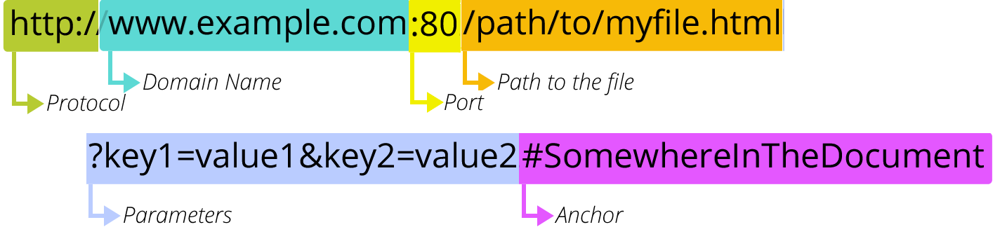

== Validation and Helpers

It's considered good design in web sites to check for valid data early -- before the data goes to the server. Note that you still have to check for valid data on the server, since HTTP requests may not come from your page but be manually created and issued (even form post requests).

HTML5 has some check for client-side validation; ASP.NET provides validators for ensuring the values are good at the server, and providing helpful messages when they are not. These will check for values you specify are valid, and will generate appropriate messages when a request's values are not valid.

This requires that we look at how data comes from the user, and at the ASP.NET utilities supplied for Validation, the `Validation` class and the ``Html.ValidationSummary`` and ``Html.ValidationMessage``
	methods. These three work in conjunction with each other.

=== Input values

Values can come in from several places: they can be submitted in a form, present in the query string of the URL, or part of the url route request.

==== ASP.NET routes

A URL has these distinct parts:

.Parts of a URL from https://developer.mozilla.org/en-US/docs/Learn/Common_questions/What_is_a_URL[What is a URL?] CC-BY-SA-2.5

The protocol, domain name, and port identify the web server. The path to the file is used by ASP.NET Routing and may become part of the input values. We will see how to access the parameters in the next section. 

So far in this material, I've always had the URL path lead directly to a file, including the .cshtml extension.  However, a key issue in Search Engine Optimization (SEO) is how pages are located and bookmarked. It is harder to get a high ranking with parameters on your URL.

ASP.NET provides an alternative interpretation of the path to allow for parameter values to be encoded in the path rather than supplied as separate parameters.  Here is its path interpretation algorithm:

. If there is a .cshtml extension on the last value in the path, locate the file and run it (this will get a 404 if there is no file).
. Otherwise, if there is no file extension on the last value, look for one with a .cshtml extention in that directory, and if found, run it.
. Otherwise, look at the parent "directory" name as if it were a file with no extension and see if there is a .cshtml file at that path; if there is such a file, run that page and pass the last value to it.
. Otherwise continue this check up the path until you find a match or root is reached; if a match is found, pass the unused part of the path   as values in UrlData.
. If no file is found and root is reached, go back to the full path and look for Default.cshtml and then Index.cshtml in that directory (all cases of those two names are used, so default and index will also be found).
            

So we could construct URLs for a page collecting social data like so:

If my URL is `http://www.myserver.com/SocialData/argoc/42` then:

1. It doesn't end in .cshtml so rule 1 is skipped.
2. Look for SocialData/argoc/42.cshtml - it won't be found as that is data for the Social Data page.
3. Look for SocialData/argoc.cshtml and be ready to pass 42 to it. It won't be found, as this is still data for my page.
4. Look for SocialData.cshtml. This one is found, so argoc/42 is passed to it in the UrlData and it is run.
5. There was no need to return to the full URL and look for /SocialData/argoc/42/Default.cshtml or /SocialData/argoc/42/Index.cshtml.

Once the page is running, it can access the path that came after it in the URL through the UrlData property available on the page. UrlData is a simple array of strings, with ``UrlData[0]`` holding the first (on the left) unused name in the path, and ``UrlData[1]`` holding the second one, and so on; all of the /-separated names are in the UrlData array.

This code would display all that were available to you; try passing "long" URLs to this page to see what shows up.

.UrlDataDemo.cshtml
[source,java]
----
include::UrlDataDemo.cshtml[]
----

==== URL parameters

A URL has these distinct partsLooking at our URL again:

.Parts of a URL from https://developer.mozilla.org/en-US/docs/Learn/Common_questions/What_is_a_URL[What is a URL?] CC-BY-SA-2.5

The protocol, domain name, and port identify the web server. The path to the file is used by ASP.NET Routing and may become part of the input values. 

The parameters in the URL are key-value pairs; if you submit your form with ``method="get"``, you will see the form fields as parameters, with the form name as the key and the form field value as the value.

These URL parameters are available to you in ASP.NET using the Query property of the page. The Query property is a dictionary index like Request; you index into it with the key, and the value is returned to you, like so:

[source,java]
----
    // if the url has ?screenName=argoc&faveNum=42:
    string screenName=Request.Query["screenName"]; // argoc
    int num = Request.Query["faveNum"].AsInt(); // 42, convert into int
----

The values are all strings, so any integers or other information will need to be converted back to their types.  Note that the URL-encoding you see in your browser bar will be turned back into characters in the Query values (spaces will be spaces, not the three charaters "%20").

==== Form fields

We have been getting form fields directly from the Request, like so: ``Request["field-name"]``.  The \[]'s look like an array index operation, and they are, but to a special array with string indexes rather than numeric ones. These are usually referred to as dictionaries -- the string key is used to look up the value.

[NOTE]
====
The .NET class behind dictionaries is called ``System.Collections.Generic.Dictionary``. It is a generic type, meaning you can say what the types are for both the key and the index. ``Request`` is a Dictionary from a string key to a string value.
====

When we use Request as the dictionary, it is actually searching 4 different parts of the HTTP request for keys (from HTML name attributes), in this order:

1. parameters 
2. form fields
3. cookies
4. client certificate
5. server variables

If you want to ensure you are only looking at one of those 5 areas' available keys, and not the other 4, then look at its particular property in request, which is also available as a dictionary with key indexing:

|====
| HTTP request portion | Property name

| parameters | QueryString
| form fields | Form
| cookies | Cookies
| client certificate | ClientCertificate
| server variables | ServerVariables
|====

We will disuss using the other three later in this chapter.

=== Check if user's input matches validation

The ASP.NET class Validator class provides static methods that let you say what fields you want to test, and how to test them. Typical checks include:

* ensuring a value was specified
* ensuring the value is the right type (int, date, string...)
* ensuring the value is in the appropriate range or matches the appropriate pattern

You should validate all portions of the form, as the user may be manually generating the post request, so select list values are not guaranteed to match those supplied.

|====
a| Validation check | Description

|Validation.RequireField(field-name, optional-error-message) |
provide the form field name (from your form's name attribute) as a string value and, if desired, the error to display when no value is provided for that field.

|Validation.RequireFields(field1-name, field2-name, ...) | provide the required fields in a single call.

| Validation.Add(field-name, validation-type) 
a| add a check on the named field. The validation-type can be:

* Validator.DateTime(optional-error-message)
* Validator.Decimal(optional-error-message)
* Validator.EqualsTo(otherField , optional-error-message)
* Validator.Float(optional-error-message)
* Validator.Integer(optional-error-message)
* Validator.Range(min, max, optional-error-message)
* Validator.RegEx(pattern, optional-error-message)
* Validator.Required(optional-error-message)
* Validator.StringLength(length)
* Validator.Url([error message])

|====

These checks would be defined at the start of your page.

=== Check if all validation tests pass

You check if the validation checks succeeded before doing any processing by calling Validation.IsValid() and checking the result, a boolean value. Since the form had to be submitted, this typically foes with the IsPost check like so:

[source,html]
----
if(IsPost && Validation.IsValid()){
    // Process form submit
}
----

If IsValid returns false, you typically skip normal page processing and re-present the form to the user with the bad values.

=== Display validation errors

The two methods `Html.ValidationMessage` and `Html.ValidationSummary` can be used to inform the user what checks did not pass. `Html.ValidationMessage` must be given the form field name; it checks the result for that particular field, and if any failed, provides their error messages. These are the messages you provided, or defaults if you did not provide any.

Typically you put `Html.ValidationMessage(field-name)` by each form field, so the message shows up when there is an issue with the value. You might put `Html.ValidationSummary` at the top of your form or by the Submit button.

Here is an example showing the Validation setup and checks:

.ValidationDemo.cshtml
[source,html]
----
include::source/ValidationDemo.cshtml[]
----

=== Client-side validation

All of our checks so far are server-side checks. Rather than require you to hand-code client-side checks in HTML5 and JavaScript, ASP.NET Web Pages provides hooks to have most checks made on the client-side as well.

[WARNING]
====
You must check values on the server, as that is the point at which the values impact potential persistent data. Checking on the client has become popular as it avoids the round-trip to the server before reporting a failure. 

Server-side checking is mandatory for a secure system; client-side checking is a nice-to-have that improves the user's experience.
====

To make these checks function on the client-side, you must register three JavaScript libraries in your page:

[source,java]
----

----

If you created your site from a template, all three files will be in your Scripts directory and can be directly referenced (the version number on jquery may differ; change the src value to match your file). 
If you are not already working with a
non-empty Web Pages template (like **Starter Site**) that includes the
library, create a Web Pages site that's based on **Starter Site**.
Then copy these three __.js__ file to your current site.  

In each form field, add a call to `Validation.For(field-name)` to get the client-side check; this will put attributes in the form field to match the required validations.

Validation.For is a Razor helper, so it is replaced by attributes that are used by client-side validation. jQuery uses these to do unobtrusive validation (thus the third script's name).

Here is our example with these two changes made:

.ValidationDemoClient.cshtml
[source,html]
----
include::source/ValidationDemoClient.cshtml[]
----

Some checks will not be made on the client: data type validation is not done. You could choose to add some of these checks, as HTML5 forms added values to the type attribute that would permit direct client-side checks of them.

These checks are made on the client (as well as the server):

*   ``Required``
*   ``Range(min,max)``
*   ``StringLength(max-length, optional-min-length])``
*   ``Regex(pattern)``
*   ``EqualsTo(otherField)``

In this example, the test for a valid URL won't work in client code.
However, the test will be performed in server code. 

Note that validation checks will be applied to form data regardless of whether it is submitted with GET or POST; however, our IsValid check only occurs if the form has been submitted via a POST request, given how we've coded the page (which, since the form is submitted POST, works just fine).

[TIP]
====
When would you want to submit form data with GET? Hint: google.com does this.

Submitting form data with GET is useful if you want to let the user bookmark the results.  

In fully-fledged web sites, if bookmarking form results is expected, usually more advanced methods are used so that the bookmark looks like a URL with no parameters - which is one key reason why ASP.NET includes routing and ways to redefine it. This can be important in Search Engine Optimization (SEO).
====

=== HTML5 validation tools

HTML5 provides several new form attributes for client-side validation of form contents. It also has CSS selectors to enable highlighting bad form values; these are not fully integrated with Validation.For, so be sure to test them carefully.

Css has a :invalid and a :valid selector that can be useful in providing visual cues to the user:

[source,html]
----
input:invalid {
  border: 1px solid red;
}
input:valid {
  border: 1px solid green;
}
----

These attributes can be used on form fields (<input>, <select>, <textarea>, and the other items active in a field):

|====
| attribute | values | description

| required | presence | field cannot be blank when submitted
| maxLength | integer | limits the numer of characters in the field
| pattern | regex | requires the input match the regular expression supplied
| min and max | integers | limit the range of values in the field
| disabled | - | value cannot be changed from what is shown
|====

The type value can be set to something other than text for more complete checking of types on the client. The recognized values are:

|====
| type value | notes

| text | constrained by maxLength
| number | can be decimal; constrained by min and max
| email | not validated in all browsers yet
| tel | semantic type for telephone numbers, but not validated due to the large variety of formats around the world
| url | valid URL
| password | not displayed to the user; however, clear-text in the POST value
| search | text field, but set up as a search 
|====

In addition you can provide <datalist>s to suggest appropriate values to the user; they can type in any value, but the datalist will be used for autocomplete if the user's input matches a prefix of any of the values.

[source,html]
----
<label for="faveUrl">What's your favorite web site?</label>
<input type="url" id="faveUrl" list="suggUrl" />
<datalist id="suggUrl">
  <option>http://google.com/</option>
  <option>http://stackoverflow.com/</option>
  <option>http://slack.net/</option>
  <option>http://wired.com.</option>
</datalist>
----

Another type of example you can provide is a "placeholder" attribute value, which puts a value in the text box that disappears as soon as the user types. The internet community has not decided whether it likes these or not, see if you think they add value to your site.

[source,html]
----
<label for="faveNum">What's your favorite number?</label>
<input type="number" id="faveNum" placeholder="42" />
----

Note that even with `type=number` in the form, the value provided to you on the server is still a string.

There are no built-in checks for dates; however there is a datepicke available in jquery-ui. This helps the user enter the date correctly, and also gives them a clear visual to improve data entry accuracy. See https://jqueryui.com/datepicker/ for details on its use.

=== Helpers

The Validation class is a Razor Helper; it is there to make generating validating web pages easier, and it does its job well.

There are several other Helper classes provided in ASP.NET to aid in generating solid web pages.

We already discussed HTML encoding issues, and the use of `Html.Raw` and `Html.Encode` to protect your site against HTML/JavaScript injection attacks.

We also covered the `WebGrid` and `Map` Helpers when we discussed collections and databases.

However, the HtmlHelper class contains quite a variety of methods that can be very useful in generating a variety of HTML structures. 

.Porting happens
[TIP]
====
It's up to you to use the form helpers or not -- if you use them, you are tieing your code very tightly to the ASP.NET section of the universe. If you write out the HTML yourself, then at least the client-side code for your website is easier to port to another web stack. Porting is the act of taking your code from one framework or language and rewriting it to work under a different framework or language. HTML5 has come a long way, so it is not as important to use the HtmlHelpers in ASP.NET as it was prior to HTML5.
====

[cols="1,2"]
|====
|Html Helper method | description

| Html.CheckBox | generate a checkbox field
| Html.DropDownList | generate a select list field
| Html.Hidden | generate a hidden field
| Html.Label | generate a label for a given field
| Html.ListBox | generate a select list field
| Html.Password | generate a password field
| Html.Radio | generate a radio-button field
| Html.TextArea | generate a textarea field
| Html.TextBox | generate a text field
|====

Each of these methods has several different implementations (it is overloaded).

For example, TextBox has these signatures:

|====
| signature | use

|TextBox(string) | generates the field with the given string as name and id attribute values.
|TextBox(string, object) | as above; the object specifies the initial value (its ToString will be used)
|TextBox(String, Object, IDictionary<String, Object>) | as above, and pass additional attributes as key/value pairs
|TextBox(String, Object, Object) | same as the previous one, using an anonymous object rather than a dictionary
|====

You can see details of these with examples on the MSDN ASP.NET Web Pages 2 Reference page on https://msdn.microsoft.com/en-us/library/system.web.webpages.html.htmlhelper_methods(v=vs.111).aspx[HtmlHelper Methods]

The following sample creates a drop down list using the helper. Helpers like this are especially useful when you are displaying a form based on values in a database (the SelectListItem can be constructed when you return values from the database).

.DropDownListHtmlHelperDemo.cshtml
[source,html]
----
include::DropDownListDemo.cshtml[]
----

Notice that the `DropDownList` requires a collection of `SelectItem`s to provide the name/value pairs needed for the list. `ListBox` behaves similarly.

The generated form looks like this on the page:

[source,html]
----

<form method="get"> <!-- choice visible in URL on submit -->
        <label for="choiceList">Choose one:</label>
        <select id="choiceList" name="choiceList">
<option value="ford">Ford</option>
<option value="chevrolet">Chevrolet</option>
<option selected="selected" value="gmc">GMC</option>
<option value="lincoln">Lincoln</option>
</select>
        <input type="submit" />
</form>
----

[TIP]
====
These Helpers become more useful in ASP.NET MVC, when Model class attributes also impact the HTML they generate.
====

'''

=== Other HTTP request data sources

As we mentioned earlier, there are 5 sources of data in an HTTP Request:

- QueryString
- Form
- Cookies
- ClientCertificate
- ServerVariables

When you access the Form fields, you usually know the names of the fields; however that may not be the case with the final three.

All five are actually collections, and so could be accessed with foreach loops, iterating through their contents.

==== Cookies

In the `Cookies` collection, each cookie is an element in the collection; it is an instance of https://msdn.microsoft.com/en-us/library/system.web.httpcookie(v=vs.110).aspx[`System.Web.HttpCookie`], with several cookie properties: 

[cols="1,3"]
|====
|HttpCookie property | description

|Domain |the domain the cookie is associated with
|HasKeys | true if the cookie has subkeys
|HttpOnly | false if the cookie is accessible by client-side script
|Item[String] | a shortcut to the Values property (for backward compatibility)
| Name | the name of the cookie (its key)
| Path | the virtual path of the cookie
|Secure	 | indicates whether to transmit using HTTPS only or not
| Shareable | if true, the cookie can participate in output caching
| Value | the cookie's value
| Values | the cookie's key/value pairs if they are embedded within the cookie
|===

It's not likely we will be using cookies with our simple applications, but there are some Helpers for Security that will be making use of them. Cookies are one way to maintain session state if you need to retain information for a user session.

`Name` and `Value` are the two properties you would be most likely to want to read, as they represent the key/value pair of the cookie.

[NOTE]
====
The European Union has strict regulations on the use of cookies, so it's best to pop up a warning to inform the user you are using cookies to satisfy their regulations, regardless of the source of the HTTP request you are processing.
====

Be careful about what you put in cookies; they travel between client and server, and so you risk exposing information in a live web site that could compromise security.

==== ClientCertificate

The `ClientCertificate` property holds an HttpClientCertificate object, which contains information about the client's security certificate, if one was provided in the HttpRequest. This class has several fields, and it is likely you would want to print them all out to get a complete view of the certificate.

|====
|ClientCertificate properties

|Certificate
|Cookie
|Flags
|IsPresent
|Issuer
|IsValid
|KeySize
|SecretKeySize
|SerialNumber
|ServerIssuer
|ServerSubject
|Subject
|ValidFrom
|ValidUntil
|====

You may find that a ToString or ObjectInfo.Print call will give you sufficient information should you need to debug a certificate. Be careful exposing this information in a live web site, as it could compromise security.

==== ServerVariables

The web server runs within an operating system itself. At the operating system level, it is possible to set environment variables. This is often done as a way to configure servers with sensitive information such as passwords - putting them in _AppStart.cshtml is not secure if your source code is Open Source, as then anyone who finds your Open Source repository can see the contents of that file.

The variables can be browsed with the ServerVariables property. This is often quite a long list, so be prepared for output if you print them all out.

The `ServerVariables` property holds a `NameValueCollection`, so is accessed like other dictionaries, getting the `AllKeys` property, which provides an array of strings, with each entry in the array being a key from the collection. Then the code needs to iterate through the keys to get the values associated with each key in turn. A `NameValueCollection` can map one key to several values, so once the values are retrieved with the `GetValues(key-value)` method as an array of strings, an embedded for loop (or foreach loop) is needed to print out that array's contents in turn.

Be careful exposing this information in a live web site, as it could compromise security.

=== Further Reading

- http://www.asp.net/web-pages/overview/ui-layouts-and-themes/validating-user-input-in-aspnet-web-pages-sites

- https://msdn.microsoft.com/en-us/library/ms972961.aspx

- https://msdn.microsoft.com/en-us/library/7kh55542.aspx

- https://developer.mozilla.org/en-US/docs/Web/Guide/HTML/Forms/Data_form_validation

- https://developer.mozilla.org/en-US/docs/Web/Guide/HTML/Forms

- https://jqueryui.com/datepicker/

- https://developer.mozilla.org/en-US/docs/Learn/Common_questions/What_is_a_URL

- https://msdn.microsoft.com/en-us/library/ms524948(v=vs.90).aspx

- http://www.asp.net/web-pages/overview/routing/creating-readable-urls-in-aspnet-web-pages-sites

- http://www.mikesdotnetting.com/Article/165/WebMatrix-URLs-UrlData-and-Routing-for-SEO

- http://www.mikesdotnetting.com/article/187/more-flexible-routing-for-asp-net-web-pages

- https://msdn.microsoft.com/en-us/library/system.web.httprequest.cookies(v=vs.110).aspx

- https://msdn.microsoft.com/en-us/library/system.web.httprequest.clientcertificate(v=vs.110).aspx

- https://msdn.microsoft.com/en-us/library/system.web.httprequest.servervariables(v=vs.110).aspx

- http://www.mikesdotnetting.com/article/184/html-helpers-for-forms-in-razor-web-pages

- https://msdn.microsoft.com/en-us/library/system.web.webpages.html.htmlhelper(v=vs.111).aspx

=== Exercises

. SEO is a big topic and very important to those attempting to "go viral" on the internet. Consider some of your past exercises. What improvements can you make to improve their SEO rating? Choose one to update to use UrlData (a path) rather than a Form submission. This may require JavaScript skills -- the submit button needs to craft the target URL based on form values.

. Make your own URL testing page: start with `UrlDataDemo.cshtml` and add loops to print out any Form data, Query data, and the Anchor as well. It should print each group of data out separately and label them to say where they are from.
+
See the MSDN documentation for https://msdn.microsoft.com/en-us/library/system.web.httprequest(v=vs.110).aspx[System.Web.HttpRequest], the class behind the Request object, to identify the properties they are stored in. Use loops on the collections, locating the keys and values.  Your page should work even if a form is submitted. Don't put a form on your page -- make a small form that targets your UrlDataDemo.cshtml to test it.

=== Lab

It is not uncommon within a project to complete one task and then move on to another. So, it's time to review your project with an eye to adding validation and helpers.

Add validation to your web site's forms, and if appropriate, make use of some of the HtmlHelpers. Do any of them make it useful for you to create page-local functions or helpers of your own? If so, do it. Development is just that -- the iteration of the process of coding, striving for better code.
