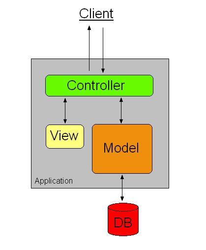

== ASP.NET MVC 5

Eventually, you will work on a web site that is just a little too big and complex for Razor Web Pages. That is where MVC comes in; MVC is "Model-View-Controller", and is a nod to a famous Design Pattern in OO programming that is very useful for applications with heavy user interaction (like web sites!).

.Model View Controller Architecture https://commons.wikimedia.org/wiki/File:MVC_Diagram.jpg[by BlueSky23] http://creativecommons.org/licenses/by-sa/3.0[CC BY-SA 3.0]

TODO summary of MVC

Could do the blog one:
https://github.com/madskristensen/MiniBlog

=== Further Reading

Here is another transformation of a Web Pages application into an MVc application. It starts from the "Bakery" template available in WebMatrix (but not in Visual Studio).

- http://www.mikesdotnetting.com/article/262/migrating-from-razor-web-pages-to-asp-net-mvc-5-views-and-controllers
- http://www.mikesdotnetting.com/article/263/migrating-from-razor-web-pages-to-asp-net-mvc-5-data-access-and-view-models
- http://www.mikesdotnetting.com/article/264/migrating-from-razor-web-pages-to-asp-net-mvc-5-model-binding-and-forms
- http://www.mikesdotnetting.com/article/210/razor-web-pages-e-commerce-adding-a-shopping-cart-to-the-bakery-template-site a post about adding a shopping cart to the bakery website (related, but expanding rather than converting)